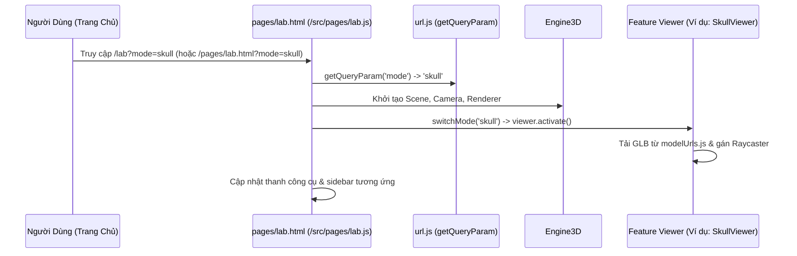

# TÀI LIỆU KIẾN TRÚC HỆ THỐNG BIOVERSE (ARCHITECTURE.MD)
## Feature-Driven Clean Modular Architecture cho Nền Tảng Giáo Dục STEM 3D

---

## 1. Tổng Quan Kiến Trúc (Architecture Overview)

BioVerse được thiết kế theo mô hình **Kiến Trúc Hướng Miền (Feature-Driven Modular Architecture)** kết hợp các nguyên lý **Clean Architecture**, phân tách rành mạch:
1. **Presentation Layer (Tầng hiển thị đa trang):** 
   - **`index.html`:** Duy nhất một file HTML ở thư mục gốc đóng vai trò Trang Chủ (Root Entry).
   - **`pages/`:** Toàn bộ các trang con (`lab.html`, `login.html`, `register.html`, `forgot-password.html`, `otp.html`, `exams.html`, `inspect.html`) được gom gọn vào thư mục `pages/` chuyên biệt.
   - **Clean URL Routing:** Nhờ middleware trong `vite.config.js`, hệ thống hỗ trợ cả định dạng sạch (`/lab`, `/login`, `/register`, `/exams`) và định dạng file (`/pages/lab.html`).
2. **Feature / Domain Layer (Tầng tính năng nghiệp vụ):** Mỗi phân hệ mô phỏng khoa học (Hộp sọ, Cơ quan nội tạng, Lab Hóa học, Trùng giày, Thực vật, Phân bào, Trắc nghiệm, Xác thực) là một module khép kín gồm Viewer + Dữ liệu + Controller riêng biệt trong `src/features/`.
3. **Core 3D Engine Layer (Tầng lõi 3D Three.js):** Quản lý vòng đời WebGLRenderer, Scene, PerspectiveCamera, OrbitControls, Resize và Animation Ticker trong `src/core/engine.js`.
4. **Services & Infrastructure Layer:** Xử lý kết nối API AI Trợ lý học tập (`aiApi.js`), Xác thực & Quản lý phiên JWT Backend (`authService.js`), định tuyến CDN/Local asset (`modelUrls.js`), và tiện ích lưu trữ `localStorage`.

---

## 2. Sơ Đồ Cấu Trúc Thư Mục (Directory Tree)

```
bio_3d/
├── index.html                    # Trang Chủ BioVerse Sổ Tay STEM (Duy nhất tại root)
│
├── pages/                        # Thư mục gom toàn bộ các trang web con
│   ├── lab.html                  # Phòng Thí Nghiệm Mô Phỏng 3D
│   ├── exams.html                # Trang Trắc Nghiệm Ôn Tập
│   ├── login.html                # Trang Đăng Nhập
│   ├── register.html             # Trang Đăng Ký
│   ├── forgot-password.html      # Trang Quên Mật Khẩu
│   ├── otp.html                  # Trang Nhập Mã OTP
│   └── inspect.html              # Công cụ xem kiểm tra GLB
│
├── public/                       # Assets tĩnh phục vụ trực tiếp qua HTTP
│   ├── models/                   # Mô hình 3D (.glb) chuẩn hóa
│   │   ├── raw/                  # Bản vẽ thiết kế gốc và model dự phòng (.blend, .glb thô)
│   │   └── *.glb                 # Các file 3D phục vụ WebGL
│   ├── icons/                    # Icons SVG
│   └── favicon.svg
│
├── scripts/                      # Công cụ và script node hỗ trợ
│   ├── inspect_glb.mjs           # Công cụ thanh tra node/mesh trong file GLB
│   └── upload-models.mjs         # Script đồng bộ model lên Cloud Storage (S3)
│
├── src/
│   ├── core/                     # Tầng lõi 3D Engine
│   │   └── engine.js             # Quản lý Scene, Camera, Renderer, Loop, Resize
│   │
│   ├── features/                 # Các module tính năng chuyên biệt (Domain Features)
│   │   ├── skull/                # Phân hệ Giải phẫu Hộp sọ người
│   │   │   ├── SkullViewer.js    # Khởi tạo mô hình hộp sọ, tô màu xương, raycaster
│   │   │   └── skullData.js      # Từ điển 22 vùng xương & chú thích y khoa
│   │   ├── organs/               # Phân hệ Cơ thể người, Tim & Tuần hoàn
│   │   │   ├── OrgansViewer.js   # Khởi tạo tim đập 3D, bóc tách buồng tim, phổi
│   │   │   └── organsData.js     # Chú thích cấu trúc van tim, tâm thất, động mạch
│   │   ├── chemistry/            # Phân hệ Phòng Thí Nghiệm Hóa Học KHTN 8
│   │   │   ├── ChemistryViewer.js# Giá thí nghiệm, ống nghiệm, bình tam giác, rót hóa chất
│   │   │   └── chemistryData.js  # Danh mục hóa chất, màu sắc & phương trình phản ứng
│   │   ├── paramecium/           # Phân hệ Sinh vật đơn bào - Trùng giày
│   │   │   ├── ParameciumViewer.js
│   │   │   └── parameciumData.js # Bào quan: không bào co bóp, rãnh miệng, nhân
│   │   ├── plant/                # Phân hệ Sinh học Thực vật
│   │   │   ├── PlantViewer.js
│   │   │   └── plantData.js      # Các giai đoạn sinh trưởng của cây
│   │   ├── mitosis/              # Phân hệ Quá trình Phân bào (Mitosis)
│   │   │   ├── MitosisSimulation.js
│   │   │   └── mitosisData.js    # 4 kỳ phân bào: Đầu, Giữa, Sau, Cuối
│   │   ├── exams/                # Phân hệ Hệ Thống Đề Thi & Trắc Nghiệm
│   │   │   └── exams.js          # Tải đề thi, bấm giờ, nộp bài, tính điểm
│   │   └── auth/                 # Phân hệ Xác thực Người dùng
│   │       └── authService.js    # Đăng nhập, Đăng ký, OTP, Lưu session học sinh
│   │
│   ├── components/               # UI Components dùng chung toàn app
│   │   └── chatBox.js            # Trợ lý AI BioBot học tập
│   │
│   ├── services/                 # Kết nối Backend & External APIs
│   │   ├── modelUrls.js          # Phân giải đường dẫn tài nguyên 3D
│   │   ├── aiApi.js              # Gửi câu hỏi đến Gemini/Backend
│   │
│   ├── styles/                   # Hệ thống Style được module hóa
│   │   ├── tokens.css            # Biến màu sắc, kích thước, font chữ
│   │   ├── sketchbook.css        # Quy chuẩn thiết kế Sổ tay Sáng tạo (Neo-Brutalism)
│   │   ├── style.css             # Overlay controls của phòng lab 3D
│   │   ├── exams.css             # Giao diện làm bài trắc nghiệm
│   │   └── chatBox.css           # Giao diện khung chat BioBot
│   │
│   ├── utils/                    # Các hàm tiện ích thuần túy (Pure Functions)
│   │   ├── dom.js                # Helper $, $$, show, hide, on
│   │   ├── url.js                # Trích xuất và cập nhật Query Parameter (?mode=...)
│   │   └── storage.js            # Thao tác an toàn với LocalStorage / SessionStorage
│   │
│   └── pages/                    # Entrypoints JavaScript cho từng trang HTML (100% no inline JS)
│       ├── home.js               # Điều khiển Trang Chủ (index.html)
│       ├── lab.js                # Điều phối chính của Lab 3D (pages/lab.html)
│       ├── exams.js              # Điều phối trang Trắc nghiệm (pages/exams.html)
│       ├── login.js              # Xử lý Đăng Nhập (pages/login.html)
│       ├── register.js           # Xử lý Đăng Ký (pages/register.html)
│       ├── forgotPassword.js     # Xử lý Quên Mật Khẩu (pages/forgot-password.html)
│       └── otp.js                # Xử lý Nhập mã OTP 6 số (pages/otp.html)
│
├── design.md                     # Bộ quy chuẩn thiết kế Scientific Sketchbook
├── ARCHITECTURE.md               # Tài liệu kiến trúc này
└── vite.config.js                # Cấu hình đóng gói Multi-Page Rollup & Clean URL rewrite
```

---

## 3. Luồng Dữ Liệu & Vòng Đời Tương Tác 3D (Lifecycle & Data Flow)

### 3.1. Luồng kích hoạt chế độ 3D từ URL


---

## 4. Hướng Dẫn Bổ Sung Thí Nghiệm / Môn Học Mới (Developer Guide)

1. Đặt file `.glb` vào `public/models/` và đăng ký trong `src/services/modelUrls.js`.
2. Tạo module mới trong `src/features/[featureName]/` (Viewer, Data).
3. Đăng ký chế độ trong Orchestrator `src/pages/lab.js`.
4. Nếu cần tạo trang HTML hoàn toàn mới, đặt file HTML trong `pages/[tên-trang].html` và tạo controller tương ứng trong `src/pages/[tên-trang].js`. Đăng ký route trong `vite.config.js`.
5. Chạy `npm run build` để xác nhận đóng gói thành công.
