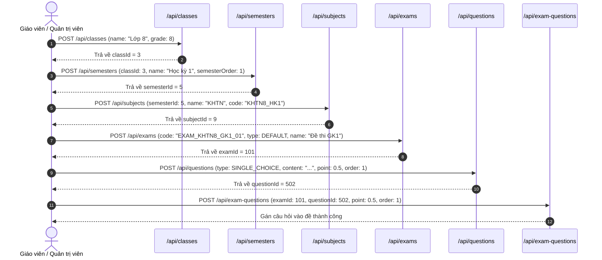

# TÀI LIỆU API CHI TIẾT & BẢNG QUY TẮC VALIDATION PHÂN HỆ EXAM

> **Dự án:** Bioverse Backend (`EXE101_group_project_BE`)  
> **Phân hệ:** `com.example.exe101_bioverse.exam`  
> **Phiên bản:** 1.2.0 (Bổ sung toàn diện Validation Rules, Error Messages, Constraints & Mẫu lỗi 400)  
> **Base URL:** `http://localhost:8080` (Local) / `https://bioverse.eraidev.id.vn` (Production)  

---

## MỤC LỤC
1. [Tổng quan phân hệ Exam](#1-tổng-quan-phân-hệ-exam)
2. [Quy chuẩn Validation & Cơ chế Xử lý Lỗi (Validation Architecture)](#2-quy-chuẩn-validation--cơ-chế-xử-lý-lỗi-validation-architecture)
3. [Bảng ma trận tổng hợp Validation Rules cho tất cả DTOs](#3-bảng-ma-trận-tổng-hợp-validation-rules-cho-tất-cả-dtos)
4. [Chi tiết từng Endpoint kèm Validation Rules & Mẫu Lỗi](#4-chi-tiết-từng-endpoint-kèm-validation-rules--mẫu-lỗi)
   - [4.1. Nhóm API Khối lớp (Grade / Classes - `/api/classes`)](#41-nhóm-api-khối-lớp-grade--classes---apiclasses)
   - [4.2. Nhóm API Học kỳ (Semesters - `/api/semesters`)](#42-nhóm-api-học-kỳ-semesters---apisemesters)
   - [4.3. Nhóm API Môn học (Subjects - `/api/subjects`)](#43-nhóm-api-môn-học-subjects---apisubjects)
   - [4.4. Nhóm API Đề thi (Exams - `/api/exams`)](#44-nhóm-api-đề-thi-exams---apiexams)
   - [4.5. Nhóm API Câu hỏi (Questions - `/api/questions`)](#45-nhóm-api-câu-hỏi-questions---apiquestions)
   - [4.6. Nhóm API Liên kết Đề thi - Câu hỏi (Exam Questions - `/api/exam-questions`)](#46-nhóm-api-liên-kết-đề-thi---câu-hỏi-exam-questions---apiexam-questions)
   - [4.7. Nhóm API Đáp án (Answers - `/api/answers`)](#47-nhóm-api-đáp-án-answers---apianswers)
   - [4.8. Nhóm API Hình ảnh Câu hỏi (Question Images - `/api/question-images`)](#48-nhóm-api-hình-ảnh-câu-hỏi-question-images---apiquestion-images)
   - [4.9. Nhóm API Hình ảnh Đáp án (Answer Images - `/api/answer-images`)](#49-nhóm-api-hình-ảnh-đáp-án-answer-images---apianswer-images)
5. [Quy trình mẫu tạo đề thi hoàn chỉnh (End-to-End Workflow)](#5-quy-trình-mẫu-tạo-đề-thi-hoàn-chỉnh-end-to-end-workflow)

---

## 1. Tổng quan phân hệ Exam

Phân hệ Exam tổ chức dữ liệu theo mô hình phân cấp học thuật chặt chẽ (Taxonomy) phục vụ việc thi cử, kiểm tra định kỳ và ôn luyện môn Khoa học Tự nhiên THCS:

```
[Khối lớp (Class / Grade: 6, 7, 8, 9)]
       │ (1 - N)
       ▼
 [Học kỳ (Semester: HK1, HK2)]
       │ (1 - N)
       ▼
  [Môn học (Subject: KHTN, Sinh học...)]
       │ (1 - N)
       ▼
   [Đề thi (Exam: 15p, 1 tiết, Giữa kỳ, Cuối kỳ)]
       │ (N - N qua ExamQuestion kèm Điểm & Thứ tự câu)
       ▼
  [Câu hỏi (Question)] ────────────┬─────────────► [Hình ảnh Câu hỏi (QuestionImage)]
       │ (1 - N)                   │
       ▼                           │
   [Đáp án (Answer)]               └─────────────► [Hình ảnh Đáp án (AnswerImage)]
```

---

## 2. Quy chuẩn Validation & Cơ chế Xử lý Lỗi (Validation Architecture)

### 2.1. Cấu trúc Response Thành công (`200 OK`)
```json
{
  "code": 1000,
  "message": "Thành công",
  "data": { ... }
}
```

### 2.2. Lỗi vi phạm Validation trên Request Body (`MethodArgumentNotValidException`)
Khi client gửi request JSON chứa các trường vi phạm ràng buộc (`@NotBlank`, `@NotNull`, `@Min`, `@Max`, `@Size`, `@Positive`, v.v.), `GlobalExceptionHandler` bắt ngoại lệ và trả về phản hồi chuẩn **HTTP 400 Bad Request**:
- `code`: **`1400`** (tương ứng `ErrorCode.INVALID_DATA`).
- `message`: `"Dữ liệu không hợp lệ"`.
- `data`: Một Map chứa danh sách các trường bị lỗi kèm câu thông báo lỗi chi tiết (`fieldErrors`).

```json
{
  "code": 1400,
  "message": "Dữ liệu không hợp lệ",
  "data": {
    "name": "Tên khối lớp không được để trống",
    "grade": "Khối lớp phải từ lớp 6 đến lớp 9"
  }
}
```

### 2.3. Lỗi vi phạm Validation trên Tham số đường dẫn Path Variable (`ConstraintViolationException`)
Các Controller đều được kích hoạt annotation `@Validated`. Khi giá trị trên URL (như `{id}`, `{grade}`, `{code}`) không hợp lệ, hệ thống trả về:
```json
{
  "code": 1400,
  "message": "getClassByGrade.grade: Khối lớp phải từ lớp 6 đến lớp 9",
  "data": null
}
```

### 2.4. Lỗi nghiệp vụ hệ thống (`AppException` & `ErrorCode`)
Khi xảy ra lỗi nghiệp vụ (ví dụ: không tìm thấy tài nguyên, trùng lặp khối lớp, hoặc tham số logic không hợp lệ), hệ thống ném `AppException(ErrorCode.xxx)` và `GlobalExceptionHandler` trả về phản hồi theo chuẩn:

```json
{
  "code": 1601,
  "message": "Không tìm thấy khối lớp",
  "data": null
}
```

#### Bảng danh mục mã lỗi nghiệp vụ phân hệ Exam (`ErrorCode` Series 16xx):

| Mã lỗi (`code`) | Tên ErrorCode | HTTP Status | Thông báo mặc định (`message`) | Mô tả tình huống xảy ra |
| :---: | :--- | :---: | :--- | :--- |
| **`1601`** | `CLASS_NOT_FOUND` | 404 NOT FOUND | `"Không tìm thấy khối lớp"` | Truy vấn / cập nhật khối lớp theo ID hoặc Grade không tồn tại |
| **`1602`** | `CLASS_GRADE_EXISTS` | 409 CONFLICT | `"Khối lớp đã tồn tại trong hệ thống"` | Tạo mới khối lớp nhưng số khối (grade) đã tồn tại |
| **`1603`** | `SEMESTER_NOT_FOUND` | 404 NOT FOUND | `"Không tìm thấy học kỳ"` | Truy vấn / cập nhật học kỳ theo ID không tồn tại |
| **`1604`** | `SUBJECT_NOT_FOUND` | 404 NOT FOUND | `"Không tìm thấy môn học"` | Truy vấn / cập nhật môn học theo ID không tồn tại |
| **`1605`** | `EXAM_NOT_FOUND` | 404 NOT FOUND | `"Không tìm thấy đề thi"` | Truy vấn / cập nhật đề thi theo ID hoặc Code không tồn tại |
| **`1606`** | `QUESTION_NOT_FOUND` | 404 NOT FOUND | `"Không tìm thấy câu hỏi"` | Truy vấn / cập nhật câu hỏi theo ID không tồn tại |
| **`1607`** | `ANSWER_NOT_FOUND` | 404 NOT FOUND | `"Không tìm thấy đáp án"` | Truy vấn / cập nhật đáp án theo ID không tồn tại |
| **`1608`** | `EXAM_QUESTION_NOT_FOUND` | 404 NOT FOUND | `"Không tìm thấy câu hỏi trong đề thi"` | Truy vấn / cập nhật liên kết ExamQuestion theo ID không tồn tại |
| **`1609`** | `QUESTION_IMAGE_NOT_FOUND` | 404 NOT FOUND | `"Không tìm thấy hình ảnh câu hỏi"` | Truy vấn / cập nhật ảnh câu hỏi theo ID không tồn tại |
| **`1610`** | `ANSWER_IMAGE_NOT_FOUND` | 404 NOT FOUND | `"Không tìm thấy hình ảnh đáp án"` | Truy vấn / cập nhật ảnh đáp án theo ID không tồn tại |
| **`1611`** | `UNSUPPORTED_RETURN_TYPE` | 400 BAD REQUEST | `"Kiểu dữ liệu phản hồi không được hỗ trợ"` | Truy vấn dạng chi tiết / cơ bản nhưng truyền `returnType` không hợp lệ |
| **`1400`** | `INVALID_DATA` | 400 BAD REQUEST | `"Dữ liệu không hợp lệ"` | Dữ liệu đầu vào sai logic hoặc vi phạm Bean Validation |

### 2.5. Danh sách Enums kiểm soát tính hợp lệ
- **`QuestionType`:** `SINGLE_CHOICE`, `MULTIPLE_CHOICE` (Không được để trống / sai cú pháp).
- **`ExamType`:** `DEFAULT`.
- **`AnswerType`:** `TEXT`, `IMAGE` (Không được để trống).

---

## 3. Bảng ma trận tổng hợp Validation Rules cho tất cả DTOs

| DTO Request | Tên trường (Field) | Kiểu dữ liệu | Bắt buộc | Validation Annotations | Thông báo lỗi khi vi phạm (`defaultMessage`) |
| :--- | :--- | :---: | :---: | :--- | :--- |
| **`ClassRequest`** | `name` | String | **Có** | `@NotBlank`, `@Size(max = 100)` | `"Tên khối lớp không được để trống"`<br>`"Tên khối lớp không được vượt quá 100 ký tự"` |
| | `grade` | Integer | **Có** | `@NotNull`, `@Min(6)`, `@Max(9)` | `"Khối lớp không được để trống"`<br>`"Khối lớp phải từ lớp 6 đến lớp 9"` |
| **`SemesterRequest`** | `classId` | Long | **Có** | `@NotNull`, `@Positive` | `"ID khối lớp không được để trống"`<br>`"ID khối lớp phải lớn hơn 0"` |
| | `name` | String | **Có** | `@NotBlank`, `@Size(max = 100)` | `"Tên học kỳ không được để trống"`<br>`"Tên học kỳ không được vượt quá 100 ký tự"` |
| | `semesterOrder` | Integer | **Có** | `@NotNull`, `@Min(1)`, `@Max(2)` | `"Thứ tự học kỳ không được để trống"`<br>`"Thứ tự học kỳ phải là 1 hoặc 2"` |
| **`SubjectRequest`** | `semesterId` | Long | **Có** | `@NotNull`, `@Positive` | `"ID học kỳ không được để trống"`<br>`"ID học kỳ phải lớn hơn 0"` |
| | `name` | String | **Có** | `@NotBlank`, `@Size(max = 100)` | `"Tên môn học không được để trống"`<br>`"Tên môn học không được vượt quá 100 ký tự"` |
| | `code` | String | **Có** | `@NotBlank`, `@Size(max = 50)` | `"Mã môn học không được để trống"`<br>`"Mã môn học không được vượt quá 50 ký tự"` |
| **`ExamRequest`** | `code` | String | **Có** | `@NotBlank`, `@Size(max = 255)` | `"Mã đề thi không được để trống"`<br>`"Mã đề thi không được vượt quá 255 ký tự"` |
| | `type` | ExamType | **Có** | `@NotNull` | `"Loại đề thi không được để trống"` |
| | `name` | String | **Có** | `@NotBlank`, `@Size(max = 255)` | `"Tiêu đề đề thi không được để trống"`<br>`"Tiêu đề đề thi không được vượt quá 255 ký tự"` |
| | `subjectName` | String | **Có** | `@NotBlank`, `@Size(max = 255)` | `"Tên môn học không được để trống"`<br>`"Tên môn học không được vượt quá 255 ký tự"` |
| | `questions` | List | Không | `@Valid` | Tự động cascade validate danh sách câu hỏi con |
| **`QuestionRequest`** | `type` | QuestionType | **Có** | `@NotNull` | `"Loại câu hỏi không được để trống"` |
| | `content` | String | **Có** | `@NotBlank` | `"Nội dung câu hỏi không được để trống"` |
| | `point` | double | **Có** | `@PositiveOrZero` | `"Điểm số không được âm"` |
| | `questionOrder`| int | **Có** | `@Min(1)` | `"Thứ tự câu hỏi phải bắt đầu từ 1"` |
| | `answers` | List | Không | `@Valid` | Tự động cascade validate danh sách đáp án |
| | `questionImageRequests` | List | Không | `@Valid` | Tự động cascade validate danh sách ảnh |
| **`ExamQuestionRequest`** | `examId` | Long | **Có** | `@NotNull`, `@Positive` | `"ID đề thi không được để trống"`<br>`"ID đề thi phải lớn hơn 0"` |
| | `questionId` | Long | **Có** | `@NotNull`, `@Positive` | `"ID câu hỏi không được để trống"`<br>`"ID câu hỏi phải lớn hơn 0"` |
| | `point` | double | **Có** | `@PositiveOrZero` | `"Điểm số không được âm"` |
| | `questionOrder`| int | **Có** | `@Min(1)` | `"Thứ tự câu hỏi phải bắt đầu từ 1"` |
| **`AnswerRequest`** | `type` | AnswerType | **Có** | `@NotNull` | `"Loại đáp án không được để trống"` |
| | `content` | String | **Có** | `@NotBlank` | `"Nội dung đáp án không được để trống"` |
| | `isCorrect` | boolean | **Có** | Primitive boolean | Không được bỏ trống giá trị boolean |
| | `answerImageRequests` | List | Không | `@Valid` | Tự động cascade validate ảnh đáp án |
| **`QuestionImageRequest`** | `url` | String | **Có** | `@NotBlank` | `"URL hình ảnh không được để trống"` |
| | `displayOrder` | int | **Có** | `@Min(1)` | `"Thứ tự hiển thị ảnh phải bắt đầu từ 1"` |
| **`AnswerImageRequest`** | `url` | String | **Có** | `@NotBlank` | `"URL hình ảnh không được để trống"` |
| | `displayOrder` | int | **Có** | `@Min(1)` | `"Thứ tự hiển thị ảnh phải bắt đầu từ 1"` |

---

## 4. Chi tiết từng Endpoint kèm Validation Rules & Mẫu Lỗi

### 4.1. Nhóm API Khối lớp (Grade / Classes - `/api/classes`)

#### 1. `POST /api/classes` - Tạo mới khối lớp
- **Chức năng:** Tạo mới một khối lớp học sinh (Lớp 6, 7, 8, 9).
- **Ràng buộc Validation (Request Body):**
  | Trường | Kiểu | Bắt buộc | Ràng buộc | Thông báo vi phạm |
  | :--- | :---: | :---: | :--- | :--- |
  | `name` | String | Có | `@NotBlank`<br>`@Size(max = 100)` | `"Tên khối lớp không được để trống"`<br>`"Tên khối lớp không được vượt quá 100 ký tự"` |
  | `grade` | Integer | Có | `@NotNull`<br>`@Min(6)`<br>`@Max(9)` | `"Khối lớp không được để trống"`<br>`"Khối lớp phải từ lớp 6 đến lớp 9"` |
  | `description` | String | Không | Tùy chọn | Không |
- **Ràng buộc nghiệp vụ (Business Rule):** Giá trị `grade` không được trùng lặp với khối lớp đã có trong hệ thống (vi phạm sẽ báo lỗi `"Khối lớp X đã tồn tại trong hệ thống."`).
- **Ví dụ Request hợp lệ:**
  ```json
  {
    "name": "Lớp 8",
    "grade": 8,
    "description": "Chương trình KHTN Lớp 8"
  }
  ```
- **Ví dụ Response thành công (200 OK):**
  ```json
  {
    "code": 1000,
    "message": "Tạo khối lớp thành công",
    "data": {
      "id": 3,
      "name": "Lớp 8",
      "grade": 8,
      "description": "Chương trình KHTN Lớp 8",
      "semesterCount": 0,
      "createdDate": "2026-09-25T15:00:00",
      "updatedDate": "2026-09-25T15:00:00"
    }
  }
  ```
- **Ví dụ Request vi phạm validation:**
  ```json
  {
    "name": "",
    "grade": 12
  }
  ```
- **Ví dụ Response lỗi Validation (400 Bad Request):**
  ```json
  {
    "code": 1400,
    "message": "Dữ liệu không hợp lệ",
    "data": {
      "grade": "Khối lớp phải từ lớp 6 đến lớp 9",
      "name": "Tên khối lớp không được để trống"
    }
  }
  ```

---

#### 2. `PUT /api/classes/{id}` - Cập nhật khối lớp
- **Chức năng:** Cập nhật thông tin khối lớp.
- **Ràng buộc Tham số Path Variable:**
  - `id`: `@Positive(message = "ID khối lớp phải lớn hơn 0")`
- **Ràng buộc Request Body:** Giống như API tạo mới `ClassRequest`.
- **Ví dụ Response thành công (200 OK):**
  ```json
  {
    "code": 1000,
    "message": "Cập nhật khối lớp thành công",
    "data": {
      "id": 3,
      "name": "Lớp 8 - Nâng cao",
      "grade": 8,
      "description": "Chương trình nâng cao",
      "semesterCount": 2,
      "createdDate": "2026-09-25T15:00:00",
      "updatedDate": "2026-09-25T15:10:00"
    }
  }
  ```
- **Ví dụ lỗi khi gửi ID âm (`PUT /api/classes/-5`):**
  ```json
  {
    "code": 1400,
    "message": "updateClass.id: ID khối lớp phải lớn hơn 0",
    "data": null
  }
  ```

---

#### 3. `GET /api/classes/{id}` - Chi tiết khối lớp theo ID
- **Ràng buộc Path Variable:** `id`: `@Positive(message = "ID khối lớp phải lớn hơn 0")`
- **Output:** `ApiResponse<ClassResponse>`

---

#### 4. `GET /api/classes/grade/{grade}` - Chi tiết khối lớp theo số lớp (Grade)
- **Ràng buộc Path Variable:**
  - `grade`: `@Min(value = 6, message = "Khối lớp phải từ lớp 6 đến lớp 9")`, `@Max(value = 9, message = "Khối lớp phải từ lớp 6 đến lớp 9")`
- **Ví dụ Request hợp lệ:** `GET /api/classes/grade/8`
- **Ví dụ lỗi khi gọi `GET /api/classes/grade/10` (400 Bad Request):**
  ```json
  {
    "code": 1400,
    "message": "getClassByGrade.grade: Khối lớp phải từ lớp 6 đến lớp 9",
    "data": null
  }
  ```

---

#### 5. `GET /api/classes` - Lấy tất cả khối lớp
- **Chức năng:** Trả về danh sách tất cả các khối lớp (sắp xếp tăng dần theo grade).
- **Output:** `ApiResponse<List<ClassResponse>>`

---

#### 6. `DELETE /api/classes/{id}` - Xóa khối lớp
- **Ràng buộc Path Variable:** `id`: `@Positive(message = "ID khối lớp phải lớn hơn 0")`
- **Output:** `ApiResponse<Void>`
- **Response (200 OK):**
  ```json
  {
    "code": 1000,
    "message": "Xóa khối lớp thành công",
    "data": null
  }
  ```

---

### 4.2. Nhóm API Học kỳ (Semesters - `/api/semesters`)

#### 1. `POST /api/semesters` - Tạo học kỳ mới
- **Chức năng:** Tạo học kỳ thuộc khối lớp.
- **Ràng buộc Validation (Request Body):**
  | Trường | Kiểu | Bắt buộc | Ràng buộc | Thông báo vi phạm |
  | :--- | :---: | :---: | :--- | :--- |
  | `classId` | Long | Có | `@NotNull`<br>`@Positive` | `"ID khối lớp không được để trống"`<br>`"ID khối lớp phải lớn hơn 0"` |
  | `name` | String | Có | `@NotBlank`<br>`@Size(max = 100)` | `"Tên học kỳ không được để trống"`<br>`"Tên học kỳ không được vượt quá 100 ký tự"` |
  | `semesterOrder` | Integer | Có | `@NotNull`<br>`@Min(1)`<br>`@Max(2)` | `"Thứ tự học kỳ không được để trống"`<br>`"Thứ tự học kỳ phải là 1 hoặc 2"` |
  | `description` | String | Không | Tùy chọn | Không |
- **Ví dụ Request hợp lệ:**
  ```json
  {
    "classId": 3,
    "name": "Học kỳ 1",
    "semesterOrder": 1,
    "description": "Học kỳ 1 năm học 2026 - 2027"
  }
  ```
- **Ví dụ Response lỗi Validation (400 Bad Request):**
  ```json
  {
    "code": 1400,
    "message": "Dữ liệu không hợp lệ",
    "data": {
      "classId": "ID khối lớp không được để trống",
      "semesterOrder": "Thứ tự học kỳ phải là 1 hoặc 2"
    }
  }
  ```

---

#### 2. `PUT /api/semesters/{id}` - Cập nhật học kỳ
- **Ràng buộc Path Variable:** `id`: `@Positive(message = "ID học kỳ phải lớn hơn 0")`
- **Ràng buộc Body:** `SemesterRequest`

---

#### 3. `GET /api/semesters/{id}` - Chi tiết học kỳ theo ID
- **Ràng buộc Path Variable:** `id`: `@Positive(message = "ID học kỳ phải lớn hơn 0")`
- **Output:** `ApiResponse<SemesterResponse>`

---

#### 4. `GET /api/semesters/class/{classId}` - Danh sách học kỳ theo Khối lớp
- **Ràng buộc Path Variable:** `classId`: `@Positive(message = "ID khối lớp phải lớn hơn 0")`
- **Output:** `ApiResponse<List<SemesterResponse>>`

---

#### 5. `GET /api/semesters` - Lấy tất cả học kỳ
- **Output:** `ApiResponse<List<SemesterResponse>>`

---

#### 6. `DELETE /api/semesters/{id}` - Xóa học kỳ
- **Ràng buộc Path Variable:** `id`: `@Positive(message = "ID học kỳ phải lớn hơn 0")`
- **Output:** `ApiResponse<Void>`

---

### 4.3. Nhóm API Môn học (Subjects - `/api/subjects`)

#### 1. `POST /api/subjects` - Tạo môn học mới
- **Chức năng:** Tạo môn học thuộc học kỳ.
- **Ràng buộc Validation (Request Body):**
  | Trường | Kiểu | Bắt buộc | Ràng buộc | Thông báo vi phạm |
  | :--- | :---: | :---: | :--- | :--- |
  | `semesterId` | Long | Có | `@NotNull`<br>`@Positive` | `"ID học kỳ không được để trống"`<br>`"ID học kỳ phải lớn hơn 0"` |
  | `name` | String | Có | `@NotBlank`<br>`@Size(max = 100)` | `"Tên môn học không được để trống"`<br>`"Tên môn học không được vượt quá 100 ký tự"` |
  | `code` | String | Có | `@NotBlank`<br>`@Size(max = 50)` | `"Mã môn học không được để trống"`<br>`"Mã môn học không được vượt quá 50 ký tự"` |
  | `description` | String | Không | Tùy chọn | Không |
- **Ví dụ Request hợp lệ:**
  ```json
  {
    "semesterId": 5,
    "name": "Khoa học Tự nhiên",
    "code": "KHTN8_HK1",
    "description": "Môn KHTN lớp 8 học kỳ 1"
  }
  ```
- **Ví dụ Response thành công (200 OK):**
  ```json
  {
    "code": 1000,
    "message": "Tạo môn học thành công",
    "data": {
      "id": 9,
      "semesterId": 5,
      "semesterName": "Học kỳ 1",
      "classId": 3,
      "className": "Lớp 8",
      "name": "Khoa học Tự nhiên",
      "code": "KHTN8_HK1",
      "description": "Môn KHTN lớp 8 học kỳ 1",
      "examCount": 0,
      "createdDate": "2026-09-25T15:20:00",
      "updatedDate": "2026-09-25T15:20:00"
    }
  }
  ```

---

#### 2. `PUT /api/subjects/{id}` - Cập nhật môn học
- **Ràng buộc Path Variable:** `id`: `@Positive(message = "ID môn học phải lớn hơn 0")`
- **Ràng buộc Body:** `SubjectRequest`

---

#### 3. `GET /api/subjects/{id}` - Chi tiết môn học theo ID
- **Ràng buộc Path Variable:** `id`: `@Positive(message = "ID môn học phải lớn hơn 0")`

---

#### 4. `GET /api/subjects/semester/{semesterId}` - Danh sách môn học theo Học kỳ
- **Ràng buộc Path Variable:** `semesterId`: `@Positive(message = "ID học kỳ phải lớn hơn 0")`

---

#### 5. `GET /api/subjects` - Lấy tất cả môn học
- **Output:** `ApiResponse<List<SubjectResponse>>`

---

#### 6. `DELETE /api/subjects/{id}` - Xóa môn học
- **Ràng buộc Path Variable:** `id`: `@Positive(message = "ID môn học phải lớn hơn 0")`

---

### 4.4. Nhóm API Đề thi (Exams - `/api/exams`)

#### 1. `POST /api/exams` - Tạo đề thi mới
- **Chức năng:** Tạo đề thi mới (có thể đính kèm danh sách câu hỏi).
- **Ràng buộc Validation (Request Body):**
  | Trường | Kiểu | Bắt buộc | Ràng buộc | Thông báo vi phạm |
  | :--- | :---: | :---: | :--- | :--- |
  | `code` | String | Có | `@NotBlank`<br>`@Size(max = 255)` | `"Mã đề thi không được để trống"`<br>`"Mã đề thi không được vượt quá 255 ký tự"` |
  | `type` | ExamType | Có | `@NotNull` | `"Loại đề thi không được để trống"` |
  | `name` | String | Có | `@NotBlank`<br>`@Size(max = 255)` | `"Tiêu đề đề thi không được để trống"`<br>`"Tiêu đề đề thi không được vượt quá 255 ký tự"` |
  | `subjectName` | String | Có | `@NotBlank`<br>`@Size(max = 255)` | `"Tên môn học không được để trống"`<br>`"Tên môn học không được vượt quá 255 ký tự"` |
  | `description` | String | Không | Tùy chọn | Không |
  | `questions` | List | Không | `@Valid` | Cascade validate danh sách câu hỏi lồng nhau |
- **Ví dụ Request hợp lệ:**
  ```json
  {
    "code": "EXAM_KHTN8_GK1_01",
    "type": "DEFAULT",
    "name": "Đề thi Giữa kỳ 1 - KHTN Lớp 8",
    "subjectName": "Khoa học Tự nhiên",
    "description": "Thời gian làm bài: 45 phút",
    "questions": []
  }
  ```
- **Ví dụ Response lỗi Validation (400 Bad Request):**
  ```json
  {
    "code": 1400,
    "message": "Dữ liệu không hợp lệ",
    "data": {
      "code": "Mã đề thi không được để trống",
      "name": "Tiêu đề đề thi không được để trống",
      "type": "Loại đề thi không được để trống"
    }
  }
  ```

---

#### 2. `GET /api/exams` - Lấy danh sách đề thi (Hỗ trợ phân trang & bộ lọc)
- **Chức năng:** Lấy danh sách đề thi dạng thẻ Catalog (phân trang, tìm kiếm theo tên/mã, lọc theo môn học, khối lớp).
- **Query Parameters (Tùy chọn):**
  - `page` (int): Số trang (mặc định: `0`)
  - `size` (int): Số phần tử trên trang (mặc định: `12`)
  - `search` (String): Từ khóa tìm kiếm theo mã đề (`code`) hoặc tiêu đề (`name`)
  - `subjectId` (Long): Lọc theo ID môn học
  - `grade` (int): Lọc theo khối lớp (6, 7, 8, 9)
  - `sort` (String): Sắp xếp (ví dụ: `createdDate,desc`, `name,asc`)
- **Output:**
  - Nếu truyền `page` hoặc các tham số lọc: `ApiResponse<PageResponse<ExamCatalogResponse>>` (chứa `items`, `totalElements`, `stats.questionCount`, `subject`, v.v.)
  - Nếu không truyền tham số: `ApiResponse<List<ExamResponse>>` (giữ nguyên tương thích ngược)

---

#### 3. `GET /api/exams/{id}` - Lấy thông tin chi tiết đề thi
- **Ràng buộc Path Variable:** `id`: `@Positive(message = "ID đề thi phải lớn hơn 0")`
- **Output:** `ApiResponse<ExamResponse>`

---

#### 4. `PUT /api/exams/{id}` - Cập nhật thông tin cơ bản đề thi
- **Ràng buộc Path Variable:** `id`: `@Positive(message = "ID đề thi phải lớn hơn 0")`
- **Request Body:** `ExamUpdateRequest` (`code`, `name`, `type`, `subjectId`, `subjectName`, `description`, `durationMinutes`, `totalScore`, `isActive`)
- **Output:** `ApiResponse<ExamResponse>`

---

#### 5. `DELETE /api/exams/{id}` - Xóa đề thi
- **Ràng buộc Path Variable:** `id`: `@Positive(message = "ID đề thi phải lớn hơn 0")`
- **Output:** `ApiResponse<Void>`

---

#### 6. `POST /api/exams/{id}/duplicate` - Nhân bản đề thi
- **Chức năng:** Sao chép cấu hình đề thi và clone toàn bộ liên kết câu hỏi sang đề thi mới.
- **Ràng buộc Path Variable:** `id`: `@Positive(message = "ID đề thi phải lớn hơn 0")`
- **Request Body:** `ExamDuplicateRequest` (`newCode`: `@NotBlank`, `newTitle`: `@NotBlank`)
- **Output:** `ApiResponse<ExamDuplicateResponse>` (`id`, `code`, `title`, `clonedQuestionsCount`)

---

#### 7. `GET /api/exams/{id}/builder` - Nạp cây cấu trúc đề thi phục vụ Xưởng biên soạn (Studio)
- **Chức năng:** Nạp toàn bộ cây dữ liệu phân cấp Đề thi ➔ Danh sách câu hỏi ➔ Danh sách đáp án ➔ Hình ảnh minh họa và kiểm tra tổng điểm hợp lệ (`summary.isValidTotalPoints`).
- **Ràng buộc Path Variable:** `id`: `@Positive(message = "ID đề thi phải lớn hơn 0")`
- **Output:** `ApiResponse<ExamBuilderResponse>`

---

#### 8. `PUT /api/exams/{id}/questions/reorder` - Sắp xếp lại thứ tự & phân bổ lại điểm số
- **Chức năng:** Cập nhật hàng loạt thứ tự câu hỏi và điểm số sau thao tác kéo thả (drag & drop).
- **Request Body:** `ExamQuestionsReorderRequest` (`items`: danh sách `{ examQuestionId, newOrder, point }`)
- **Output:** `ApiResponse<ExamReorderResponse>` (`totalQuestions`, `totalPoints`)

---

#### 9. `POST /api/exams/{id}/questions/composite` (hoặc `POST /api/exams/{id}/questions`) - Thêm câu hỏi nguyên khối kèm đáp án
- **Chức năng:** Tạo mới câu hỏi, danh sách đáp án, ảnh minh họa và tự động gắn vào đề thi trong 1 transaction duy nhất.
- **Request Body:** `CompositeQuestionRequest` (`content`, `point`, `type`, `difficultyLevel`, `topic`, `explanation`, `images`, `answers`)
- **Output:** `ApiResponse<CompositeQuestionResponse>` (`examQuestionId`, `questionId`, `questionOrder`, `point`, `content`, `answersCount`)

---

#### 10. `DELETE /api/exams/{id}/questions/{questionId}` - Gỡ câu hỏi khỏi đề thi
- **Chức năng:** Xóa liên kết `exam_question` giữa đề thi và câu hỏi.
- **Output:** `ApiResponse<Void>`

---

#### 11. `POST /api/exams/{id}/questions/pick-from-bank` - Gắn câu hỏi từ ngân hàng vào đề thi
- **Request Body:** `PickFromBankRequest` (`questionIds`: danh sách ID câu hỏi, `defaultPoint`: điểm mặc định)
- **Output:** `ApiResponse<List<ExamQuestionResponse>>`

---

#### 12. `GET /api/exams/subject/{subjectName}` - Lọc đề theo Tên môn học
- **Ràng buộc Path Variable:** `subjectName`: `@NotBlank(message = "Tên môn học không được để trống")`

---

#### 13. `GET /api/exams/type/{type}` - Lọc đề theo Thể loại đề
- **Ràng buộc Path Variable:** `type`: `@NotBlank(message = "Loại đề thi không được để trống")`

---

#### 14. `GET /api/exams/name/{name}` - Tìm kiếm đề theo Tiêu đề
- **Ràng buộc Path Variable:** `name`: `@NotBlank(message = "Tên đề thi không được để trống")`

---

#### 15. `GET /api/exams/code/{code}` - Lấy chi tiết đề theo Mã đề
- **Ràng buộc Path Variable:** `code`: `@NotBlank(message = "Mã đề thi không được để trống")`

---

### 4.5. Nhóm API Câu hỏi (Questions - `/api/questions`)

#### 1. `POST /api/questions` - Tạo câu hỏi mới
- **Chức năng:** Tạo câu hỏi độc lập (kèm đáp án và hình minh họa).
- **Ràng buộc Validation (Request Body):**
  | Trường | Kiểu | Bắt buộc | Ràng buộc | Thông báo vi phạm |
  | :--- | :---: | :---: | :--- | :--- |
  | `type` | QuestionType | Có | `@NotNull` | `"Loại câu hỏi không được để trống"` |
  | `content` | String | Có | `@NotBlank` | `"Nội dung câu hỏi không được để trống"` |
  | `point` | double | Có | `@PositiveOrZero` | `"Điểm số không được âm"` |
  | `questionOrder`| int | Có | `@Min(1)` | `"Thứ tự câu hỏi phải bắt đầu từ 1"` |
  | `explain` | String | Không | Tùy chọn | Không |
  | `description` | String | Không | Tùy chọn | Không |
  | `answers` | List | Không | `@Valid` | Tự động kiểm tra từng phần tử `AnswerRequest` |
  | `questionImageRequests` | List | Không | `@Valid` | Tự động kiểm tra từng phần tử `QuestionImageRequest` |
- **Ví dụ Request hợp lệ:**
  ```json
  {
    "type": "SINGLE_CHOICE",
    "content": "Bào quan nào sau đây là nhà máy năng lượng của tế bào?",
    "point": 0.5,
    "questionOrder": 1,
    "explain": "Ti thể sản xuất ATP qua hô hấp tế bào.",
    "answers": [
      {
        "type": "TEXT",
        "content": "Ti thể",
        "isCorrect": true,
        "explain": "Đúng"
      },
      {
        "type": "TEXT",
        "content": "Không bào",
        "isCorrect": false,
        "explain": "Sai"
      }
    ]
  }
  ```
- **Ví dụ Response lỗi Validation (400 Bad Request):**
  ```json
  {
    "code": 1400,
    "message": "Dữ liệu không hợp lệ",
    "data": {
      "content": "Nội dung câu hỏi không được để trống",
      "questionOrder": "Thứ tự câu hỏi phải bắt đầu từ 1"
    }
  }
  ```

---

#### 2. `GET /api/questions/bank` - Tìm kiếm ngân hàng câu hỏi (Phân trang & bộ lọc)
- **Chức năng:** Lấy danh sách câu hỏi trong ngân hàng đề thi để tái sử dụng.
- **Query Parameters:**
  - `search` (String): Từ khóa tìm kiếm nội dung câu hỏi
  - `type` (QuestionType): Lọc theo loại câu hỏi (`SINGLE_CHOICE`, `MULTIPLE_CHOICE`)
  - `page` (int, mặc định `0`)
  - `size` (int, mặc định `10`)
- **Output:** `ApiResponse<PageResponse<QuestionResponse>>`

---

#### 3. `GET /api/questions/{id}` - Chi tiết câu hỏi theo ID
- **Ràng buộc Path Variable:** `id`: `@Positive(message = "ID câu hỏi phải lớn hơn 0")`

---

#### 4. `PUT /api/questions/{id}` - Cập nhật nội dung câu hỏi
- **Ràng buộc Path Variable:** `id`: `@Positive(message = "ID câu hỏi phải lớn hơn 0")`
- **Request Body:** `QuestionUpdateRequest` (`content`, `type`, `explain`, `description`)
- **Output:** `ApiResponse<QuestionResponse>`

---

#### 5. `DELETE /api/questions/{id}` - Xóa câu hỏi
- **Ràng buộc Path Variable:** `id`: `@Positive(message = "ID câu hỏi phải lớn hơn 0")`
- **Output:** `ApiResponse<Void>`

---

#### 6. `POST /api/questions/{questionId}/answers` - Thêm đáp án cho câu hỏi
- **Ràng buộc Path Variable:** `questionId`: `@Positive(message = "ID câu hỏi phải lớn hơn 0")`
- **Request Body:** `AnswerRequest` (`content`: `@NotBlank`, `type`: `@NotNull`, `isCorrect`: boolean)
- **Output:** `ApiResponse<AnswerResponse>`

---

#### 7. `GET /api/questions/exam/{examId}` - Danh sách câu hỏi trong Đề thi
- **Ràng buộc Path Variable:** `examId`: `@Positive(message = "ID đề thi phải lớn hơn 0")`

---

#### 8. `GET /api/questions/type/{questionType}` - Lọc câu hỏi theo Loại (QuestionType)
- **Ràng buộc Path Variable:** `questionType`: `@NotNull(message = "Loại câu hỏi không được để trống")` (chỉ chấp nhận `SINGLE_CHOICE` hoặc `MULTIPLE_CHOICE`)

---

### 4.6. Nhóm API Liên kết Đề thi - Câu hỏi (Exam Questions - `/api/exam-questions`)

#### 1. `POST /api/exam-questions` - Gán câu hỏi vào đề thi
- **Chức năng:** Tạo liên kết N - N giữa đề và câu hỏi kèm điểm số & thứ tự câu.
- **Ràng buộc Validation (Request Body):**
  | Trường | Kiểu | Bắt buộc | Ràng buộc | Thông báo vi phạm |
  | :--- | :---: | :---: | :--- | :--- |
  | `examId` | Long | Có | `@NotNull`<br>`@Positive` | `"ID đề thi không được để trống"`<br>`"ID đề thi phải lớn hơn 0"` |
  | `questionId` | Long | Có | `@NotNull`<br>`@Positive` | `"ID câu hỏi không được để trống"`<br>`"ID câu hỏi phải lớn hơn 0"` |
  | `point` | double | Có | `@PositiveOrZero` | `"Điểm số không được âm"` |
  | `questionOrder`| int | Có | `@Min(1)` | `"Thứ tự câu hỏi phải bắt đầu từ 1"` |
- **Ví dụ Request hợp lệ:**
  ```json
  {
    "examId": 101,
    "questionId": 502,
    "point": 0.5,
    "questionOrder": 1
  }
  ```

---

#### 2. `GET /api/exam-questions/exam/{examId}` - Danh sách liên kết theo đề
- **Ràng buộc Path Variable:** `examId`: `@Positive(message = "ID đề thi phải lớn hơn 0")`

---

#### 3. `GET /api/exam-questions/exam/{examId}/question/{questionId}` - Chi tiết liên kết cụ thể
- **Ràng buộc Path Variable:**
  - `examId`: `@Positive(message = "ID đề thi phải lớn hơn 0")`
  - `questionId`: `@Positive(message = "ID câu hỏi phải lớn hơn 0")`

---

### 4.7. Nhóm API Đáp án (Answers - `/api/answers`)

#### 1. `POST /api/answers` - Tạo phương án đáp án mới
- **Ràng buộc Validation (Request Body):**
  | Trường | Kiểu | Bắt buộc | Ràng buộc | Thông báo vi phạm |
  | :--- | :---: | :---: | :--- | :--- |
  | `type` | AnswerType | Có | `@NotNull` | `"Loại đáp án không được để trống"` (`TEXT` hoặc `IMAGE`) |
  | `content` | String | Có | `@NotBlank` | `"Nội dung đáp án không được để trống"` |
  | `isCorrect` | boolean | Có | Kiểu boolean | Bắt buộc xác định `true` hoặc `false` |
  | `questionId` | Long | Tùy chọn | Không | ID câu hỏi liên kết |
  | `answerImageRequests` | List | Không | `@Valid` | Cascade validate ảnh đính kèm nếu có |
- **Ví dụ Request hợp lệ:**
  ```json
  {
    "questionId": 502,
    "type": "TEXT",
    "content": "Ti thể",
    "isCorrect": true,
    "explain": "Chính xác"
  }
  ```

---

#### 2. `PUT /api/answers/{id}` - Cập nhật nội dung đáp án
- **Ràng buộc Path Variable:** `id`: `@Positive(message = "ID đáp án phải lớn hơn 0")`
- **Request Body:** `AnswerRequest`
- **Output:** `ApiResponse<AnswerResponse>`

---

#### 3. `DELETE /api/answers/{id}` - Xóa đáp án
- **Ràng buộc Path Variable:** `id`: `@Positive(message = "ID đáp án phải lớn hơn 0")`
- **Output:** `ApiResponse<Void>`

---

#### 4. `GET /api/answers/question/{questionId}` - Danh sách đáp án của câu hỏi
- **Ràng buộc Path Variable:** `questionId`: `@Positive(message = "ID câu hỏi phải lớn hơn 0")`

---

### 4.8. Nhóm API Hình ảnh Câu hỏi (Question Images - `/api/question-images`)

#### 1. `POST /api/question-images` - Đính kèm ảnh cho câu hỏi
- **Ràng buộc Validation (Request Body):**
  | Trường | Kiểu | Bắt buộc | Ràng buộc | Thông báo vi phạm |
  | :--- | :---: | :---: | :--- | :--- |
  | `url` | String | Có | `@NotBlank` | `"URL hình ảnh không được để trống"` |
  | `displayOrder` | int | Có | `@Min(1)` | `"Thứ tự hiển thị ảnh phải bắt đầu từ 1"` |
  | `name` | String | Không | Tùy chọn | Tên / Chú thích ảnh |
  | `questionId` | Long | Không | Tùy chọn | ID câu hỏi liên kết |

---

#### 2. `DELETE /api/question-images/{id}` - Xóa ảnh câu hỏi
- **Ràng buộc Path Variable:** `id`: `@Positive(message = "ID ảnh câu hỏi phải lớn hơn 0")`
- **Output:** `ApiResponse<Void>`

---

#### 3. `GET /api/question-images/question/{questionId}` - Lấy ảnh của câu hỏi
- **Ràng buộc Path Variable:** `questionId`: `@Positive(message = "ID câu hỏi phải lớn hơn 0")`

---

### 4.9. Nhóm API Hình ảnh Đáp án (Answer Images - `/api/answer-images`)

#### 1. `POST /api/answer-images` - Đính kèm ảnh cho đáp án
- **Ràng buộc Validation (Request Body):**
  | Trường | Kiểu | Bắt buộc | Ràng buộc | Thông báo vi phạm |
  | :--- | :---: | :---: | :--- | :--- |
  | `url` | String | Có | `@NotBlank` | `"URL hình ảnh không được để trống"` |
  | `displayOrder` | int | Có | `@Min(1)` | `"Thứ tự hiển thị ảnh phải bắt đầu từ 1"` |
  | `name` | String | Không | Tùy chọn | Tên / Chú thích ảnh |
  | `answerId` | Long | Không | Tùy chọn | ID đáp án liên kết |

---

#### 2. `DELETE /api/answer-images/{id}` - Xóa ảnh đáp án
- **Ràng buộc Path Variable:** `id`: `@Positive(message = "ID ảnh đáp án phải lớn hơn 0")`
- **Output:** `ApiResponse<Void>`

---

#### 3. `GET /api/answer-images/answer/{answerId}` - Lấy ảnh của đáp án
- **Ràng buộc Path Variable:** `answerId`: `@Positive(message = "ID đáp án phải lớn hơn 0")`

---

### 4.10. Nhóm API Quản lý Media & Upload Hình ảnh (Media - `/api/media`)

#### 1. `POST /api/media/upload` - Upload file ảnh trực tiếp lên Cloud Storage (Cloudflare R2)
- **Chức năng:** Tải tệp ảnh nhị phân trực tiếp từ trình duyệt và lưu vào kho Cloud Storage.
- **Content-Type:** `multipart/form-data`
- **Request Form-Data:**
  | Tên tham số | Kiểu dữ liệu | Bắt buộc | Ràng buộc | Mô tả |
  | :--- | :---: | :---: | :--- | :--- |
  | `file` | MultipartFile | Có | File không rỗng, max 5MB, format: `JPG`, `PNG`, `WebP` | Tệp hình ảnh cần upload |
  | `folder` | String | Không | Mặc định: `"exams"` (hoặc `"exams/questions"`, `"exams/answers"`) | Thư mục phân loại lưu trữ |
- **Ví dụ Response thành công (201 Created):**
  ```json
  {
    "code": 1000,
    "message": "Upload hình ảnh thành công",
    "data": {
      "url": "https://storage.bioverse.edu.vn/exams/questions/550e8400-e29b-41d4-a716-446655440000.png",
      "fileName": "cell_structure.png",
      "fileSize": 248102,
      "mimeType": "image/png"
    }
  }
  ```
- **Mã lỗi có thể gặp:**
  - `1410` (`INVALID_FILE`): Chưa chọn file hoặc định dạng file không được hỗ trợ.
  - `1411` (`FILE_TOO_LARGE`): Dung lượng file vượt quá 5MB.

#### 2. `GET /api/answer-images/answer/{answerId}` - Lấy ảnh của đáp án
- **Ràng buộc Path Variable:** `answerId`: `@Positive(message = "ID đáp án phải lớn hơn 0")`

---

### 4.11. Nhóm API Học sinh Làm bài & Chống Gian lận (Student Exam Flow - `/api/student`)

Nhóm API phục vụ toàn bộ hành trình làm bài kiểm tra của học sinh:
- **Lấy đề thi Anti-Cheat:** Ẩn hoàn toàn trường `isCorrect` và `explanation` để học sinh không thể mở F12 DevTools xem đáp án trước.
- **Nộp bài & Server chấm điểm:** Server nhận danh sách đáp án học sinh chọn, tính điểm chính thức trên thang 10, lưu lịch sử `ExamAttempt` và tính thưởng XP.
- **Xem lại bài làm & Lời giải:** Trả về chi tiết từng câu hỏi (đáp án học sinh chọn, đáp án đúng của hệ thống và lời giải thích chi tiết).
- **Lịch sử thi:** Học sinh xem lại tất cả bài thi đã làm kèm tổng kết điểm trung bình, điểm cao nhất, tổng thời gian và biểu đồ tiến bộ.

---

#### 1. `GET /api/student/exams/{id}/paper` - Lấy đề thi chống gian lận (Anti-Cheat)
- **Mô tả:** Trả về toàn bộ câu hỏi và danh sách đáp án trong đề thi mà không có thông tin đáp án đúng (`isCorrect`) hoặc lời giải (`explanation`).
- **HTTP Method:** `GET`
- **URL:** `/api/student/exams/{id}/paper`
- **Ví dụ Response (200 OK):**
  ```json
  {
    "code": 1000,
    "message": "Thành công",
    "data": {
      "examId": 1,
      "code": "DE_GK1_KHTN6_01",
      "name": "Đề thi giữa kì 1 KHTN 6 Kết nối tri thức - Đề số 1",
      "subjectName": "Khoa học Tự nhiên",
      "description": "Thời gian làm bài: 45 phút",
      "durationMinutes": 45,
      "totalScore": 10.0,
      "totalQuestions": 40,
      "questions": [
        {
          "id": 101,
          "questionOrder": 1,
          "type": "SINGLE_CHOICE",
          "point": 0.25,
          "content": "Khoa học tự nhiên nghiên cứu về lĩnh vực nào dưới đây?",
          "modelAssetId": null,
          "images": [],
          "answers": [
            {
              "id": 501,
              "type": "TEXT",
              "content": "Các sự vật, hiện tượng tự nhiên.",
              "images": []
            },
            {
              "id": 502,
              "type": "TEXT",
              "content": "Tâm lý con người trong xã hội.",
              "images": []
            }
          ]
        }
      ]
    }
  }
  ```

---

#### 2. `POST /api/student/exams/{id}/submit` - Nộp bài thi & Server chấm điểm tự động
- **Mô tả:** Học sinh nộp bài thi lên server. Server đối chiếu từng câu hỏi với đáp án đúng trong CSDL, tính điểm trên thang 10, cộng XP và lưu kết quả vào `exam_attempts` & `attempt_answers`.
- **HTTP Method:** `POST`
- **URL:** `/api/student/exams/{id}/submit`
- **Headers:** `Authorization: Bearer <access_token>`
- **Request Body:**
  ```json
  {
    "startedAt": "2026-09-25T20:00:00",
    "timeSpentSec": 2400,
    "answers": [
      {
        "questionId": 101,
        "selectedAnswerId": 501,
        "timeSpentSec": 45
      },
      {
        "questionId": 102,
        "selectedAnswerId": 506,
        "timeSpentSec": 60
      }
    ]
  }
  ```
- **Validation Rules:**
  - `answers`: Bắt buộc (`@NotNull`), không được rỗng.
  - `answers[].questionId`: Bắt buộc (`@NotNull`).
  - `answers[].selectedAnswerId`: Nullable (nếu học sinh bỏ trống không chọn).
- **Ví dụ Response (200 OK):**
  ```json
  {
    "code": 1000,
    "message": "Thành công",
    "data": {
      "attemptId": 88,
      "examId": 1,
      "examTitle": "Đề thi giữa kì 1 KHTN 6 Kết nối tri thức - Đề số 1",
      "score": 9.5,
      "totalQuestions": 40,
      "correctCount": 38,
      "timeSpentSec": 2400,
      "earnedXp": 95,
      "submittedAt": "2026-09-25T20:40:00",
      "feedback": "Xuất sắc! Bạn nắm rất vững kiến thức và hoàn thành bài thi một cách hoàn hảo!"
    }
  }
  ```

---

#### 3. `GET /api/student/exam-attempts/{attemptId}` - Xem lại bài làm & Lời giải chi tiết
- **Mô tả:** Trả về kết quả bài thi chi tiết của học sinh: câu nào đúng, câu nào sai, đáp án học sinh đã chọn (`isSelected: true`), đáp án đúng của hệ thống (`isCorrect: true`) và giải thích chi tiết (`explanation`).
- **HTTP Method:** `GET`
- **URL:** `/api/student/exam-attempts/{attemptId}`
- **Headers:** `Authorization: Bearer <access_token>`
- **Ví dụ Response (200 OK):**
  ```json
  {
    "code": 1000,
    "message": "Thành công",
    "data": {
      "attemptId": 88,
      "examId": 1,
      "examCode": "DE_GK1_KHTN6_01",
      "examTitle": "Đề thi giữa kì 1 KHTN 6 Kết nối tri thức - Đề số 1",
      "score": 9.5,
      "totalQuestions": 40,
      "correctCount": 38,
      "timeSpentSec": 2400,
      "startedAt": "2026-09-25T20:00:00",
      "submittedAt": "2026-09-25T20:40:00",
      "questions": [
        {
          "questionId": 101,
          "questionOrder": 1,
          "content": "Khoa học tự nhiên nghiên cứu về lĩnh vực nào dưới đây?",
          "type": "SINGLE_CHOICE",
          "point": 0.25,
          "earnedPoint": 0.25,
          "explanation": "Khoa học tự nhiên nghiên cứu về: các sự vật, hiện tượng tự nhiên; các quy luật tự nhiên.",
          "selectedAnswerId": 501,
          "isCorrect": true,
          "modelAssetId": null,
          "images": [],
          "answers": [
            {
              "id": 501,
              "type": "TEXT",
              "content": "Các sự vật, hiện tượng tự nhiên.",
              "isCorrect": true,
              "isSelected": true,
              "images": []
            },
            {
              "id": 502,
              "type": "TEXT",
              "content": "Tâm lý con người trong xã hội.",
              "isCorrect": false,
              "isSelected": false,
              "images": []
            }
          ]
        }
      ]
    }
  }
  ```

---

#### 4. `GET /api/student/exam-attempts/my-history` - Xem lịch sử thi của học sinh
- **Mô tả:** Cho phép học sinh xem lại toàn bộ các bài thi đã thực hiện kèm bảng tổng kết (tổng số đề thi đã làm, điểm trung bình, điểm cao nhất, tổng thời gian ôn luyện).
- **HTTP Method:** `GET`
- **URL:** `/api/student/exam-attempts/my-history`
- **Headers:** `Authorization: Bearer <access_token>`
- **Ví dụ Response (200 OK):**
  ```json
  {
    "code": 1000,
    "message": "Thành công",
    "data": {
      "summary": {
        "totalExamsTaken": 5,
        "averageScore": 8.7,
        "highestScore": 10.0,
        "totalTimeSpentSec": 9600,
        "totalCorrectQuestions": 174
      },
      "attempts": [
        {
          "attemptId": 88,
          "examId": 1,
          "examCode": "DE_GK1_KHTN6_01",
          "examTitle": "Đề thi giữa kì 1 KHTN 6 Kết nối tri thức - Đề số 1",
          "subjectName": "Khoa học Tự nhiên",
          "score": 9.5,
          "totalQuestions": 40,
          "correctCount": 38,
          "timeSpentSec": 2400,
          "submittedAt": "2026-09-25T20:40:00"
        }
      ]
    }
  }
  ```

---

## 5. Quy trình mẫu tạo đề thi hoàn chỉnh (End-to-End Workflow)

Để tạo một bài kiểm tra KHTN trực quan hoàn chỉnh trên nền tảng Bioverse tuân thủ đầy đủ các quy tắc validation, người quản trị thực hiện theo 6 bước tuần tự:



### Bước 1: Khởi tạo Khối lớp (Grade 8)
```bash
curl -X POST "http://localhost:8080/api/classes" \
     -H "Content-Type: application/json" \
     -d '{
       "name": "Lớp 8",
       "grade": 8,
       "description": "Khối lớp 8 cấp THCS"
     }'
```

### Bước 2: Tạo Học kỳ trực thuộc Khối lớp (Học kỳ 1)
```bash
curl -X POST "http://localhost:8080/api/semesters" \
     -H "Content-Type: application/json" \
     -d '{
       "classId": 3,
       "name": "Học kỳ 1",
       "semesterOrder": 1,
       "description": "Học kỳ 1"
     }'
```

### Bước 3: Tạo Môn học trực thuộc Học kỳ (Khoa học Tự nhiên)
```bash
curl -X POST "http://localhost:8080/api/subjects" \
     -H "Content-Type: application/json" \
     -d '{
       "semesterId": 5,
       "name": "Khoa học Tự nhiên",
       "code": "KHTN8_HK1",
       "description": "Môn KHTN 8 Học kỳ 1"
     }'
```

### Bước 4: Tạo Đề thi mới
```bash
curl -X POST "http://localhost:8080/api/exams" \
     -H "Content-Type: application/json" \
     -d '{
       "code": "EXAM_KHTN8_GK1_01",
       "type": "DEFAULT",
       "name": "Đề thi Giữa kỳ 1 - KHTN Lớp 8",
       "subjectName": "Khoa học Tự nhiên",
       "description": "Thời gian làm bài: 45 phút"
     }'
```

### Bước 5: Tạo Câu hỏi độc lập và Các đáp án
```bash
curl -X POST "http://localhost:8080/api/questions" \
     -H "Content-Type: application/json" \
     -d '{
       "type": "SINGLE_CHOICE",
       "content": "Bào quan nào sau đây là nhà máy năng lượng của tế bào?",
       "point": 0.5,
       "questionOrder": 1,
       "explain": "Ti thể thực hiện hô hấp tế bào và tạo ATP cung cấp năng lượng.",
       "description": "Câu hỏi nhận biết",
       "answers": [
         {
           "type": "TEXT",
           "content": "Ti thể",
           "isCorrect": true,
           "explain": "Chính xác"
         },
         {
           "type": "TEXT",
           "content": "Không bào",
           "isCorrect": false,
           "explain": "Không bào chứa dịch tế bào"
         }
       ]
     }'
```

### Bước 6: Gán câu hỏi vào Đề thi với thang điểm và vị trí câu
```bash
curl -X POST "http://localhost:8080/api/exam-questions" \
     -H "Content-Type: application/json" \
     -d '{
       "examId": 101,
       "questionId": 502,
       "point": 0.5,
       "questionOrder": 1
     }'
```

---

*Tài liệu được cập nhật tự động và đồng bộ chính xác theo các quy chuẩn Jakarta Bean Validation trong mã nguồn thực tế của phân hệ `com.example.exe101_bioverse.exam`.*
