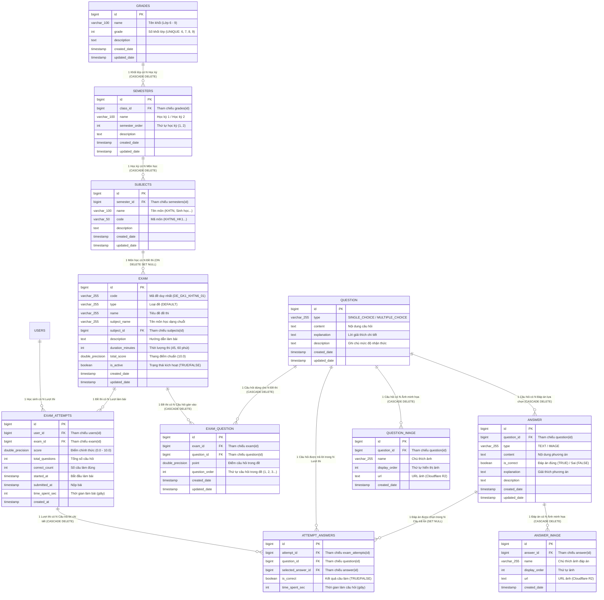

# TÀI LIỆU CHI TIẾT CÁC ENTITY, MỐI QUAN HỆ & CHỨC NĂNG PHÂN HỆ EXAM

> **Dự án:** Bioverse Backend (`EXE101_group_project_BE`)  
> **Package:** `com.example.exe101_bioverse.exam`  
> **Cơ sở dữ liệu:** PostgreSQL 16 (Hỗ trợ Local & Supabase)  
> **ORM Framework:** Spring Data JPA / Hibernate 6  
> **Phiên bản cập nhật:** 2.0.0 (Bổ sung Xưởng biên soạn Exam Studio & Luồng khảo thí Student Exam Flow)  

---

## MỤC LỤC
1. [Tổng quan phân hệ Exam](#1-tổng-quan-phân-hệ-exam)
2. [Sơ đồ quan hệ thực thể (ERD Diagram)](#2-sơ-đồ-quan-hệ-thực-thể-erd-diagram)
3. [Mô tả chi tiết từng Entity](#3-mô-tả-chi-tiết-từng-entity)
   - [3.1. Entity `Grade` (Bảng `grades`)](#31-entity-grade-bảng-grades)
   - [3.2. Entity `Semester` (Bảng `semesters`)](#32-entity-semester-bảng-semesters)
   - [3.3. Entity `Subject` (Bảng `subjects`)](#33-entity-subject-bảng-subjects)
   - [3.4. Entity `Exam` (Bảng `exam`)](#34-entity-exam-bảng-exam)
   - [3.5. Entity `ExamQuestion` (Bảng `exam_question`)](#35-entity-examquestion-bảng-exam_question)
   - [3.6. Entity `Question` (Bảng `question`)](#36-entity-question-bảng-question)
   - [3.7. Entity `Answer` (Bảng `answer`)](#37-entity-answer-bảng-answer)
   - [3.8. Entity `QuestionImage` (Bảng `question_image`)](#38-entity-questionimage-bảng-question_image)
   - [3.9. Entity `AnswerImage` (Bảng `answer_image`)](#39-entity-answerimage-bảng-answer_image)
   - [3.10. Entity `ExamAttempt` (Bảng `exam_attempts`)](#310-entity-examattempt-bảng-exam_attempts)
   - [3.11. Entity `AttemptAnswer` (Bảng `attempt_answers`)](#311-entity-attemptanswer-bảng-attempt_answers)
4. [Phân tích ma trận mối quan hệ & Hành vi Cascade](#4-phân-tích-ma-trận-mối-quan-hệ--hành-vi-cascade)
5. [Mô tả chức năng nghiệp vụ của các Service](#5-mô-tả-chức-năng-nghiệp-vụ-của-các-service)
6. [Quy tắc toàn vẹn dữ liệu, Tối ưu hiệu năng & Bảo mật chống gian lận](#6-quy-tắc-toàn-vẹn-dữ-liệu-tối-ưu-hiệu-năng--bảo-mật-chống-gian-lận)

---

## 1. Tổng quan phân hệ Exam

Phân hệ **Exam** chịu trách nhiệm quản lý toàn bộ cấu trúc học thuật, ngân hàng câu hỏi trắc nghiệm, xưởng biên soạn đề kiểm tra (Exam Studio) và luồng khảo thí trực tuyến cho học sinh môn Khoa học Tự nhiên (KHTN) cấp Trung học Cơ sở (Lớp 6 đến Lớp 9).

Phân hệ được tổ chức thành 3 nhóm thực thể chính:
1. **Nhóm cấu trúc phân cấp học thuật (Academic Taxonomy):**
   - Cây phân cấp chuẩn quốc gia: `Grade` (Khối lớp 6-9) ➔ `Semester` (Học kỳ 1, 2) ➔ `Subject` (Môn học: KHTN, Sinh, Hóa, Lý) ➔ `Exam` (Đề kiểm tra).
2. **Nhóm ngân hàng câu hỏi & Xưởng biên soạn đề (Assessment & Question Bank):**
   - Độc lập hóa ngân hàng câu hỏi `Question` và các `Answer`, liên kết linh hoạt với `Exam` thông qua bảng trung gian `ExamQuestion` (cho phép tái sử dụng câu hỏi trên nhiều đề khác nhau, tùy biến điểm số và số thứ tự hiển thị).
   - Đa phương tiện trực quan: hình ảnh minh họa câu hỏi (`QuestionImage`), hình ảnh minh họa phương án (`AnswerImage`), tích hợp mô hình 3D sinh học (`modelAssetId`).
   - Cấu hình đề thi mở rộng: thời lượng làm bài (`durationMinutes`), thang điểm chuẩn (`totalScore`), cờ kích hoạt phát hành (`isActive`).
3. **Nhóm khảo thí, nộp bài & lịch sử học sinh (Student Examination & Grading):**
   - Lưu trữ từng lượt thi của học sinh (`ExamAttempt`) với điểm số chính thức trên thang 10, số câu đúng, tổng thời gian và điểm thưởng kinh nghiệm (XP).
   - Lưu trữ chi tiết phương án học sinh đã chọn cho từng câu hỏi (`AttemptAnswer`), phục vụ tính năng xem lại bài làm, tra cứu lời giải giải thích (`explain`) và đối chiếu với đáp án chuẩn.

---

## 2. Sơ đồ quan hệ thực thể (ERD Diagram)

---

## 3. Mô tả chi tiết từng Entity

### 3.1. Entity `Grade` (Bảng `grades`)
- **Package:** `com.example.exe101_bioverse.exam.entity.Grade`
- **Tên bảng Database:** `grades` (Flyway Migration `V19`)
- **Ý nghĩa nghiệp vụ:** Đại diện cho một khối lớp học sinh cấp THCS (Lớp 6, 7, 8, 9). Đây là gốc rễ của cây phân cấp nội dung thi cử.

#### Danh sách thuộc tính:
| Tên thuộc tính Java | Tên cột DB | Kiểu dữ liệu | Ràng buộc | Mô tả nghiệp vụ |
| :--- | :--- | :--- | :--- | :--- |
| `id` | `id` | `Long` / `BIGSERIAL` | **PK**, Not Null | Định danh duy nhất khối lớp |
| `name` | `name` | `String` / `VARCHAR(100)` | Not Null | Tên hiển thị (Ví dụ: `"Lớp 6"`, `"Lớp 7"`, `"Lớp 8"`, `"Lớp 9"`) |
| `grade` | `grade` | `Integer` / `INT` | **UNIQUE**, Not Null | Cấp số lớp (`6`, `7`, `8`, `9`) |
| `description` | `description` | `String` / `TEXT` | Nullable | Mô tả tổng quát về chương trình khối lớp |
| `createdDate` | `created_date`| `LocalDateTime` / `TIMESTAMP` | Not Null | Thời điểm tạo bản ghi |
| `updatedDate` | `updated_date`| `LocalDateTime` / `TIMESTAMP` | Not Null | Thời điểm cập nhật bản ghi gần nhất |

#### Quan hệ JPA:
- `@OneToMany(mappedBy = "grade", cascade = CascadeType.ALL, orphanRemoval = true)`:
  - Một khối lớp có nhiều học kỳ (`List<Semester> semesters`). Khi xóa khối lớp, toàn bộ học kỳ thuộc khối lớp đó sẽ tự động bị xóa.
- **Lifecycle Callbacks:** `@PrePersist` và `@PreUpdate` tự động cập nhật `createdDate` và `updatedDate`.

---

### 3.2. Entity `Semester` (Bảng `semesters`)
- **Package:** `com.example.exe101_bioverse.exam.entity.Semester`
- **Tên bảng Database:** `semesters` (Flyway Migration `V19`)
- **Ý nghĩa nghiệp vụ:** Đại diện cho một học kỳ trong năm học (Học kỳ 1 hoặc Học kỳ 2) trực thuộc một khối lớp cụ thể.

#### Danh sách thuộc tính:
| Tên thuộc tính Java | Tên cột DB | Kiểu dữ liệu | Ràng buộc | Mô tả nghiệp vụ |
| :--- | :--- | :--- | :--- | :--- |
| `id` | `id` | `Long` / `BIGSERIAL` | **PK**, Not Null | Định danh duy nhất học kỳ |
| `name` | `name` | `String` / `VARCHAR(100)` | Not Null | Tên học kỳ (Ví dụ: `"Học kỳ 1"`, `"Học kỳ 2"`) |
| `semesterOrder` | `semester_order` | `Integer` / `INT` | Default: 1 | Thứ tự thời gian của học kỳ (`1` hoặc `2`) |
| `description` | `description` | `String` / `TEXT` | Nullable | Ghi chú thêm về học kỳ |
| `createdDate` | `created_date`| `LocalDateTime` / `TIMESTAMP` | Not Null | Thời điểm tạo bản ghi |
| `updatedDate` | `updated_date`| `LocalDateTime` / `TIMESTAMP` | Not Null | Thời điểm cập nhật gần nhất |

#### Quan hệ JPA:
- `@ManyToOne(fetch = FetchType.LAZY)` + `@JoinColumn(name = "class_id", nullable = false)`:
  - Thuộc về một thực thể `Grade`. Cột khóa ngoại là `class_id` tham chiếu đến `grades(id)`.
- `@OneToMany(mappedBy = "semester", cascade = CascadeType.ALL, orphanRemoval = true)`:
  - Một học kỳ có danh sách nhiều môn học (`List<Subject> subjects`). Xóa học kỳ sẽ tự động cascade xóa toàn bộ môn học thuộc học kỳ đó.

---

### 3.3. Entity `Subject` (Bảng `subjects`)
- **Package:** `com.example.exe101_bioverse.exam.entity.Subject`
- **Tên bảng Database:** `subjects` (Flyway Migration `V19`)
- **Ý nghĩa nghiệp vụ:** Đại diện cho môn học thuộc về một học kỳ xác định (Khoa học Tự nhiên, Sinh học, Hóa học, Vật lý).

#### Danh sách thuộc tính:
| Tên thuộc tính Java | Tên cột DB | Kiểu dữ liệu | Ràng buộc | Mô tả nghiệp vụ |
| :--- | :--- | :--- | :--- | :--- |
| `id` | `id` | `Long` / `BIGSERIAL` | **PK**, Not Null | Định danh duy nhất môn học |
| `name` | `name` | `String` / `VARCHAR(100)` | Not Null | Tên môn học (Ví dụ: `"Khoa học Tự nhiên"`) |
| `code` | `code` | `String` / `VARCHAR(50)` | Nullable | Mã định danh nội bộ (Ví dụ: `"KHTN6_HK1"`) |
| `description` | `description` | `String` / `TEXT` | Nullable | Mô tả chương trình học môn học |
| `createdDate` | `created_date`| `LocalDateTime` / `TIMESTAMP` | Not Null | Thời điểm tạo bản ghi |
| `updatedDate` | `updated_date`| `LocalDateTime` / `TIMESTAMP` | Not Null | Thời điểm cập nhật gần nhất |

#### Quan hệ JPA:
- `@ManyToOne(fetch = FetchType.LAZY)` + `@JoinColumn(name = "semester_id", nullable = false)`:
  - Thuộc về một `Semester`. Cột khóa ngoại `semester_id` tham chiếu `semesters(id)`.
- `@OneToMany(mappedBy = "subject", cascade = CascadeType.ALL, orphanRemoval = true)`:
  - Một môn học chứa danh sách các đề thi (`List<Exam> exams`).

---

### 3.4. Entity `Exam` (Bảng `exam`)
- **Package:** `com.example.exe101_bioverse.exam.entity.Exam`
- **Tên bảng Database:** `exam` (Flyway Migration `V1`, `V9`, `V19`, `V20`)
- **Ý nghĩa nghiệp vụ:** Đại diện cho một bài kiểm tra / đề thi (giữa kỳ 1, cuối kỳ 1, giữa kỳ 2, cuối kỳ 2, kiểm tra 15 phút, 1 tiết). Hỗ trợ cấu hình thời lượng, thang điểm và trạng thái hoạt động phục vụ Xưởng biên soạn Exam Studio.

#### Danh sách thuộc tính:
| Tên thuộc tính Java | Tên cột DB | Kiểu dữ liệu | Ràng buộc | Mô tả nghiệp vụ |
| :--- | :--- | :--- | :--- | :--- |
| `id` | `id` | `Long` / `BIGSERIAL` | **PK**, Not Null | Định danh duy nhất bài thi |
| `code` | `code` | `String` / `VARCHAR(255)` | Nullable / Indexed | Mã đề thi duy nhất (Ví dụ: `"DE_GK1_KHTN6_01"`) |
| `type` | `type` | `ExamType` / `VARCHAR(255)` | Enum String | Loại đề kiểm tra (`DEFAULT`) |
| `name` | `name` | `String` / `VARCHAR(255)` | Nullable | Tiêu đề đề thi (Ví dụ: `"Đề thi giữa kì 1 KHTN 6 Kết nối tri thức - Đề số 1"`) |
| `subjectName` | `subject_name` | `String` / `VARCHAR(255)` | Nullable | Tên môn học lưu trực tiếp (Ví dụ: `"Khoa học Tự nhiên"`) |
| `description` | `description` | `String` / `TEXT` | Nullable | Hướng dẫn làm bài, giới hạn thời gian làm bài |
| `durationMinutes` | `duration_minutes` | `Integer` / `INT` | Default: 45 | Thời gian làm bài tính bằng phút (45 phút GK, 60 phút CK) |
| `totalScore` | `total_score` | `Double` / `DOUBLE PRECISION`| Default: 10.0 | Thang điểm chuẩn của bài thi (mặc định 10.0) |
| `isActive` | `is_active` | `Boolean` / `BOOLEAN` | Default: TRUE | Trạng thái kích hoạt (TRUE: công khai học sinh làm bài, FALSE: bản nháp) |
| `createdDate` | `created_date`| `LocalDateTime` / `TIMESTAMP` | Nullable | Thời điểm khởi tạo đề thi |
| `updatedDate` | `updated_date`| `LocalDateTime` / `TIMESTAMP` | Nullable | Thời điểm cập nhật đề thi |

#### Quan hệ JPA:
- `@ManyToOne(fetch = FetchType.LAZY)` + `@JoinColumn(name = "subject_id")`:
  - Liên kết với thực thể `Subject`. Khóa ngoại DB: `ON DELETE SET NULL` (đảm bảo không bao giờ mất đề thi nếu tái cơ cấu môn học).
- `@OneToMany(mappedBy = "exam", cascade = CascadeType.ALL, orphanRemoval = true)`:
  - Chứa danh sách các liên kết câu hỏi `List<ExamQuestion> examQuestions`. Khi xóa một bài kiểm tra, các liên kết trong `exam_question` sẽ tự động bị xóa, nhưng câu hỏi gốc trong ngân hàng vẫn được giữ nguyên.

---

### 3.5. Entity `ExamQuestion` (Bảng `exam_question`)
- **Package:** `com.example.exe101_bioverse.exam.entity.ExamQuestion`
- **Tên bảng Database:** `exam_question` (Flyway Migration `V1`)
- **Ý nghĩa nghiệp vụ:** Bảng quan hệ trung gian Nhiều - Nhiều (**Many-to-Many**) giữa `Exam` và `Question`. Thực thể này cho phép tái sử dụng câu hỏi cho nhiều đề thi khác nhau mà vẫn có thể cấu hình điểm số và vị trí câu độc lập cho từng đề.

#### Danh sách thuộc tính:
| Tên thuộc tính Java | Tên cột DB | Kiểu dữ liệu | Ràng buộc | Mô tả nghiệp vụ |
| :--- | :--- | :--- | :--- | :--- |
| `id` | `id` | `Long` / `BIGSERIAL` | **PK**, Not Null | Định danh bản ghi liên kết |
| `point` | `point` | `double` / `DOUBLE PRECISION` | Not Null | Điểm số của câu hỏi trong đề thi này (Ví dụ: `0.25`, `0.5`, `1.0`) |
| `questionOrder`| `question_order` | `int` / `INT` | Not Null | Thứ tự xuất hiện của câu hỏi trong đề thi (Ví dụ: Câu 1, Câu 2...) |
| `createdDate` | `created_date` | `LocalDateTime` / `TIMESTAMP` | Nullable | Thời điểm liên kết được tạo |
| `updatedDate` | `updated_date` | `LocalDateTime` / `TIMESTAMP` | Nullable | Thời điểm liên kết được cập nhật |

#### Quan hệ JPA:
- `@ManyToOne(fetch = FetchType.LAZY)` + `@JoinColumn(name = "exam_id")`:
  - Tham chiếu đến bài thi `Exam`. Khóa ngoại DB: `ON DELETE CASCADE`.
- `@ManyToOne(fetch = FetchType.LAZY)` + `@JoinColumn(name = "question_id")`:
  - Tham chiếu đến câu hỏi `Question`. Khóa ngoại DB: `ON DELETE CASCADE`.

---

### 3.6. Entity `Question` (Bảng `question`)
- **Package:** `com.example.exe101_bioverse.exam.entity.Question`
- **Tên bảng Database:** `question` (Flyway Migration `V1`, `V20`)
- **Ý nghĩa nghiệp vụ:** Đại diện cho một câu hỏi độc lập trong ngân hàng câu hỏi. Câu hỏi có thể có nhiều phương án trả lời (`Answer`) và nhiều hình minh họa (`QuestionImage`).

#### Danh sách thuộc tính:
| Tên thuộc tính Java | Tên cột DB | Kiểu dữ liệu | Ràng buộc | Mô tả nghiệp vụ |
| :--- | :--- | :--- | :--- | :--- |
| `id` | `id` | `Long` / `BIGSERIAL` | **PK**, Not Null | Định danh duy nhất câu hỏi |
| `type` | `type` | `QuestionType` / `VARCHAR(255)` | Enum String | Loại câu hỏi: `SINGLE_CHOICE` (chọn 1) hoặc `MULTIPLE_CHOICE` (chọn nhiều) |
| `content` | `content` | `String` / `TEXT` | Nullable | Nội dung chi tiết câu hỏi |
| `explain` | `explanation` | `String` / `TEXT` | Nullable | Lời giải thích cặn kẽ đáp án đúng phục vụ học sinh sau khi nộp bài |
| `description` | `description` | `String` / `TEXT` | Nullable | Ghi chú bổ sung (mức độ: Nhận biết, Thông hiểu, Vận dụng) |
| `createdDate` | `created_date` | `LocalDateTime` / `TIMESTAMP` | Nullable | Thời điểm tạo câu hỏi |
| `updatedDate` | `updated_date` | `LocalDateTime` / `TIMESTAMP` | Nullable | Thời điểm sửa câu hỏi gần nhất |

#### Quan hệ JPA:
- `@OneToMany(mappedBy = "question", cascade = CascadeType.ALL, orphanRemoval = true)`:
  - `List<ExamQuestion> examQuestions`: Các liên kết đề thi đang sử dụng câu hỏi này.
- `@OneToMany(mappedBy = "question", cascade = CascadeType.ALL, orphanRemoval = true)`:
  - `List<QuestionImage> questionImages`: Danh sách hình ảnh minh họa cho câu hỏi (sơ đồ cấu tạo, hình dụng cụ).
- `@OneToMany(mappedBy = "question", cascade = CascadeType.ALL, orphanRemoval = true)`:
  - `List<Answer> answers`: Danh sách các phương án trả lời (A, B, C, D). Xóa câu hỏi sẽ tự động xóa sạch các đáp án trực thuộc.

---

### 3.7. Entity `Answer` (Bảng `answer`)
- **Package:** `com.example.exe101_bioverse.exam.entity.Answer`
- **Tên bảng Database:** `answer` (Flyway Migration `V1`, `V20`)
- **Ý nghĩa nghiệp vụ:** Đại diện cho một phương án trả lời (lựa chọn) của câu hỏi trắc nghiệm.

#### Danh sách thuộc tính:
| Tên thuộc tính Java | Tên cột DB | Kiểu dữ liệu | Ràng buộc | Mô tả nghiệp vụ |
| :--- | :--- | :--- | :--- | :--- |
| `id` | `id` | `Long` / `BIGSERIAL` | **PK**, Not Null | Định danh duy nhất đáp án |
| `type` | `type` | `AnswerType` / `VARCHAR(255)` | Enum String | Dạng nội dung đáp án: `TEXT` (văn bản) hoặc `IMAGE` (hình vẽ) |
| `content` | `content` | `String` / `TEXT` | Nullable | Nội dung phương án lựa chọn |
| `isCorrect` | `is_correct` | `boolean` / `BOOLEAN` | Not Null | Cờ xác định phương án đúng (`true`) hay phương án gây nhiễu (`false`) |
| `explain` | `explanation` | `String` / `TEXT` | Nullable | Lời giải thích lý do phương án này đúng hay sai |
| `description` | `description` | `String` / `TEXT` | Nullable | Ghi chú thêm |
| `createdDate` | `created_date` | `LocalDateTime` / `TIMESTAMP` | Nullable | Thời điểm tạo |
| `updatedDate` | `updated_date` | `LocalDateTime` / `TIMESTAMP` | Nullable | Thời điểm cập nhật |

#### Quan hệ JPA:
- `@ManyToOne(fetch = FetchType.LAZY)` + `@JoinColumn(name = "question_id")`:
  - Thuộc về một câu hỏi `Question`. Khóa ngoại DB: `ON DELETE CASCADE`.
- `@OneToMany(mappedBy = "answer", cascade = CascadeType.ALL, orphanRemoval = true)`:
  - `List<AnswerImage> answerImages`: Hình ảnh minh họa đi kèm phương án trả lời.

---

### 3.8. Entity `QuestionImage` (Bảng `question_image`)
- **Package:** `com.example.exe101_bioverse.exam.entity.QuestionImage`
- **Tên bảng Database:** `question_image` (Flyway Migration `V1`, `V20`)
- **Ý nghĩa nghiệp vụ:** Lưu trữ hình ảnh minh họa cho câu hỏi (sơ đồ cấu tạo tế bào, bảng số liệu, hình vẽ thí nghiệm).

#### Danh sách thuộc tính:
| Tên thuộc tính Java | Tên cột DB | Kiểu dữ liệu | Ràng buộc | Mô tả nghiệp vụ |
| :--- | :--- | :--- | :--- | :--- |
| `id` | `id` | `Long` / `BIGSERIAL` | **PK**, Not Null | Định danh duy nhất hình ảnh |
| `name` | `name` | `String` / `VARCHAR(255)` | Nullable | Tên mô tả hoặc chú thích hình ảnh (Caption) |
| `displayOrder` | `display_order`| `int` / `INT` | Not Null | Thứ tự sắp xếp ảnh trong câu hỏi |
| `url` | `url` | `String` / `TEXT` | Nullable | Đường dẫn URL của file hình ảnh (lưu trên Cloudflare R2) |
| `createdDate` | `created_date` | `LocalDateTime` / `TIMESTAMP` | Nullable | Thời điểm tải lên ảnh |

#### Quan hệ JPA:
- `@ManyToOne(fetch = FetchType.LAZY)` + `@JoinColumn(name = "question_id")`:
  - Tham chiếu đến câu hỏi `Question`. Khóa ngoại DB: `ON DELETE CASCADE`.

---

### 3.9. Entity `AnswerImage` (Bảng `answer_image`)
- **Package:** `com.example.exe101_bioverse.exam.entity.AnswerImage`
- **Tên bảng Database:** `answer_image` (Flyway Migration `V1`, `V20`)
- **Ý nghĩa nghiệp vụ:** Lưu trữ hình ảnh minh họa đính kèm cho một phương án trả lời cụ thể (trắc nghiệm nhận diện hình vẽ cấu trúc giải phẫu).

#### Danh sách thuộc tính:
| Tên thuộc tính Java | Tên cột DB | Kiểu dữ liệu | Ràng buộc | Mô tả nghiệp vụ |
| :--- | :--- | :--- | :--- | :--- |
| `id` | `id` | `Long` / `BIGSERIAL` | **PK**, Not Null | Định danh duy nhất hình ảnh đáp án |
| `name` | `name` | `String` / `VARCHAR(255)` | Nullable | Tên mô tả hoặc chú thích phương án |
| `displayOrder` | `display_order`| `int` / `INT` | Not Null | Thứ tự sắp xếp ảnh |
| `url` | `url` | `String` / `TEXT` | Nullable | Đường dẫn URL của hình ảnh (lưu trên Cloudflare R2) |
| `createdDate` | `created_date` | `LocalDateTime` / `TIMESTAMP` | Nullable | Thời điểm tải lên ảnh |

#### Quan hệ JPA:
- `@ManyToOne(fetch = FetchType.LAZY)` + `@JoinColumn(name = "answer_id")`:
  - Tham chiếu đến phương án `Answer`. Khóa ngoại DB: `ON DELETE CASCADE`.

---

### 3.10. Entity `ExamAttempt` (Bảng `exam_attempts`)
- **Package:** `com.example.exe101_bioverse.exam.entity.ExamAttempt`
- **Tên bảng Database:** `exam_attempts` (Flyway Migration `V9`)
- **Ý nghĩa nghiệp vụ:** Đại diện cho một lượt làm bài thi của học sinh trên hệ thống. Lưu lại điểm số chính thức, số câu làm đúng, thời gian làm bài thực tế và thời điểm nộp bài.

#### Danh sách thuộc tính:
| Tên thuộc tính Java | Tên cột DB | Kiểu dữ liệu | Ràng buộc | Mô tả nghiệp vụ |
| :--- | :--- | :--- | :--- | :--- |
| `id` | `id` | `Long` / `BIGSERIAL` | **PK**, Not Null | Định danh duy nhất lượt làm bài |
| `user` | `user_id` | `User` / `BIGINT` | **FK**, Not Null | Học sinh thực hiện bài thi (tham chiếu `users(id)`) |
| `exam` | `exam_id` | `Exam` / `BIGINT` | **FK**, Not Null | Đề thi được thực hiện (tham chiếu `exam(id)`) |
| `score` | `score` | `Double` / `DOUBLE PRECISION`| Nullable | Điểm số chính thức đạt được trên thang 10.0 (Ví dụ: `9.5`) |
| `totalQuestions` | `total_questions`| `Integer` / `INT` | Nullable | Tổng số lượng câu hỏi trong đề thi tại thời điểm làm bài |
| `correctCount` | `correct_count` | `Integer` / `INT` | Nullable | Số lượng câu hỏi học sinh trả lời đúng |
| `startedAt` | `started_at` | `LocalDateTime` / `TIMESTAMP`| Not Null | Thời điểm học sinh bắt đầu làm bài thi |
| `submittedAt` | `submitted_at` | `LocalDateTime` / `TIMESTAMP`| Nullable | Thời điểm học sinh nộp bài lên hệ thống |
| `timeSpentSec` | `time_spent_sec` | `Integer` / `INT` | Nullable | Tổng thời lượng làm bài tính bằng giây (Ví dụ: `2400`s = 40 phút) |
| `createdAt` | `created_at` | `LocalDateTime` / `TIMESTAMP`| Not Null | Thời điểm tạo bản ghi lượt thi |

#### Quan hệ JPA:
- `@ManyToOne(fetch = FetchType.LAZY)` + `@JoinColumn(name = "user_id", nullable = false)`: Tham chiếu đến học sinh `User`.
- `@ManyToOne(fetch = FetchType.LAZY)` + `@JoinColumn(name = "exam_id", nullable = false)`: Tham chiếu đến đề thi `Exam`.
- `@OneToMany(mappedBy = "attempt", cascade = CascadeType.ALL, orphanRemoval = true)`:
  - `List<AttemptAnswer> attemptAnswers`: Danh sách chi tiết từng câu trả lời mà học sinh đã chọn trong lượt thi này. Khi xóa bản ghi lượt thi, toàn bộ các câu trả lời chi tiết sẽ tự động bị xóa theo.

---

### 3.11. Entity `AttemptAnswer` (Bảng `attempt_answers`)
- **Package:** `com.example.exe101_bioverse.exam.entity.AttemptAnswer`
- **Tên bảng Database:** `attempt_answers` (Flyway Migration `V9`)
- **Ý nghĩa nghiệp vụ:** Lưu trữ câu trả lời chi tiết cho từng câu hỏi trong một lượt thi cụ thể. Cho phép học sinh xem lại bài làm, biết rõ câu nào làm đúng, câu nào làm sai và đối chiếu với đáp án đúng của hệ thống.

#### Danh sách thuộc tính:
| Tên thuộc tính Java | Tên cột DB | Kiểu dữ liệu | Ràng buộc | Mô tả nghiệp vụ |
| :--- | :--- | :--- | :--- | :--- |
| `id` | `id` | `Long` / `BIGSERIAL` | **PK**, Not Null | Định danh duy nhất câu trả lời trong lượt thi |
| `attempt` | `attempt_id` | `ExamAttempt` / `BIGINT` | **FK**, Not Null | Thuộc về lượt thi nào (tham chiếu `exam_attempts(id)`) |
| `question` | `question_id` | `Question` / `BIGINT` | **FK**, Not Null | Câu hỏi được trả lời (tham chiếu `question(id)`) |
| `selectedAnswer` | `selected_answer_id` | `Answer` / `BIGINT` | **FK**, Nullable | Phương án học sinh đã chọn (tham chiếu `answer(id)`, `NULL` nếu học sinh bỏ qua) |
| `isCorrect` | `is_correct` | `Boolean` / `BOOLEAN` | Nullable | `TRUE` nếu chọn đúng phương án, `FALSE` nếu chọn sai hoặc chưa làm |
| `timeSpentSec` | `time_spent_sec` | `Integer` / `INT` | Nullable | Thời gian học sinh suy nghĩ và trả lời riêng cho câu này (giây) |

#### Quan hệ JPA:
- `@ManyToOne(fetch = FetchType.LAZY)` + `@JoinColumn(name = "attempt_id", nullable = false)`: Tham chiếu đến `ExamAttempt`. Khóa ngoại DB: `ON DELETE CASCADE`.
- `@ManyToOne(fetch = FetchType.LAZY)` + `@JoinColumn(name = "question_id", nullable = false)`: Tham chiếu đến câu hỏi `Question`.
- `@ManyToOne(fetch = FetchType.LAZY)` + `@JoinColumn(name = "selected_answer_id")`: Tham chiếu đến phương án `Answer` được chọn.

---

## 4. Phân tích ma trận mối quan hệ & Hành vi Cascade

| Cặp thực thể (A ➔ B) | Loại quan hệ | Phía sở hữu (Owner) | Hành vi Cascade JPA | Ràng buộc DB Foreign Key | Ý nghĩa thực tế |
| :--- | :---: | :---: | :---: | :---: | :--- |
| `Grade` ➔ `Semester` | **1 - N** | `Semester` (`class_id`) | `ALL`, `orphanRemoval` | `ON DELETE CASCADE` | Xóa Khối lớp thì tự động xóa toàn bộ Học kỳ của khối đó |
| `Semester` ➔ `Subject` | **1 - N** | `Subject` (`semester_id`) | `ALL`, `orphanRemoval` | `ON DELETE CASCADE` | Xóa Học kỳ thì tự động xóa toàn bộ Môn học thuộc học kỳ đó |
| `Subject` ➔ `Exam` | **1 - N** | `Exam` (`subject_id`) | `ALL`, `orphanRemoval` | `ON DELETE SET NULL` | Xóa Môn học thì `subject_id` trong Đề thi về `NULL`, **không làm mất đề thi** |
| `Exam` ➔ `ExamQuestion` | **1 - N** | `ExamQuestion` (`exam_id`) | `ALL`, `orphanRemoval` | `ON DELETE CASCADE` | Xóa Đề thi thì xóa liên kết câu hỏi của đề, **bảo toàn câu hỏi gốc** |
| `Question` ➔ `ExamQuestion` | **1 - N** | `ExamQuestion` (`question_id`)| `ALL`, `orphanRemoval` | `ON DELETE CASCADE` | Xóa Câu hỏi thì xóa sạch liên kết của câu hỏi đó khỏi tất cả các đề |
| `Question` ➔ `Answer` | **1 - N** | `Answer` (`question_id`) | `ALL`, `orphanRemoval` | `ON DELETE CASCADE` | Xóa Câu hỏi thì xóa sạch các phương án lựa chọn của nó |
| `Question` ➔ `QuestionImage`| **1 - N** | `QuestionImage` (`question_id`)| `ALL`, `orphanRemoval` | `ON DELETE CASCADE` | Xóa Câu hỏi thì xóa ảnh minh họa câu hỏi |
| `Answer` ➔ `AnswerImage` | **1 - N** | `AnswerImage` (`answer_id`) | `ALL`, `orphanRemoval` | `ON DELETE CASCADE` | Xóa Phương án thì xóa ảnh minh họa phương án |
| `User` ➔ `ExamAttempt` | **1 - N** | `ExamAttempt` (`user_id`) | Không dùng Cascade xóa User | Khóa ngoại tham chiếu `users(id)` | Mỗi học sinh có một lịch sử làm bài thi độc lập |
| `Exam` ➔ `ExamAttempt` | **1 - N** | `ExamAttempt` (`exam_id`) | Không cascade xóa lượt thi | Khóa ngoại tham chiếu `exam(id)` | Lưu giữ kết quả thi của học sinh gắn liền với đề |
| `ExamAttempt` ➔ `AttemptAnswer` | **1 - N** | `AttemptAnswer` (`attempt_id`) | `ALL`, `orphanRemoval` | `ON DELETE CASCADE` | Xóa lượt thi thì xóa sạch danh sách chi tiết các câu trả lời của lượt thi đó |
| `Question` ➔ `AttemptAnswer` | **1 - N** | `AttemptAnswer` (`question_id`)| Không cascade | Khóa ngoại tham chiếu `question(id)` | Liên kết câu trả lời với câu hỏi trong ngân hàng |
| `Answer` ➔ `AttemptAnswer` | **1 - N** | `AttemptAnswer` (`selected_answer_id`) | Không cascade | Khóa ngoại tham chiếu `answer(id)` | Ghi nhận đáp án học sinh đã chọn |

---

## 5. Mô tả chức năng nghiệp vụ của các Service

Toàn bộ logic nghiệp vụ được đóng gói độc lập trong package `com.example.exe101_bioverse.exam.service.impl`:

### 5.1. `ClassServiceImpl` (Triển khai `GradeService`)
- Quản lý toàn bộ vòng đời của Khối lớp (`Grade`).
- Kiểm tra tính duy nhất của giá trị `grade` (chỉ chấp nhận các lớp 6, 7, 8, 9; từ chối nếu tạo trùng lặp số lớp).
- Tính toán tổng số lượng học kỳ (`semesterCount`) trực thuộc khi trả về DTO `ClassResponse`.

### 5.2. `SemesterServiceImpl` (Triển khai `SemesterService`)
- Quản lý học kỳ (`Semester`).
- Kiểm tra sự tồn tại của `classId` trước khi gán học kỳ vào khối lớp.
- Tính toán tổng số lượng môn học (`subjectCount`) của học kỳ và tự động liên kết tên khối lớp (`className`, `classGrade`).

### 5.3. `SubjectServiceImpl` (Triển khai `SubjectService`)
- Quản lý môn học theo học kỳ (`Subject`).
- Kiểm tra sự tồn tại của `semesterId`.
- Đếm số lượng đề thi (`examCount`) đang thuộc về môn học này.

### 5.4. `ExamServiceImpl` (Triển khai `ExamService`)
- **Quản lý danh mục & Thống kê (`getExamCatalog`):**
  - Phân trang & bộ lọc đa tiêu chí: `keyword`, `subjectId`, `gradeId`, `semesterId`, `isActive`.
  - Tính toán số liệu thống kê tổng hợp `stats`: tổng số đề thi, đề đang kích hoạt (`activeExams`), đề bản nháp (`draftExams`), tổng số câu hỏi trong toàn hệ thống (`totalQuestionsCount`).
  - Tổng kết phân bố số lượng đề theo môn học (`subjectSummary`).
- **Xưởng biên soạn đề thi (`getExamBuilder`):**
  - Cung cấp toàn bộ dữ liệu cho màn hình Studio: thông tin đề thi, tổng điểm tính toán từ các câu hỏi (`calculatedTotalPoints`), cờ kiểm tra khớp điểm chuẩn (`isValidTotalPoints`), danh sách câu hỏi kèm đáp án, ảnh và model 3D theo đúng thứ tự `questionOrder`.
- **Cập nhật & Xóa đề thi:**
  - `updateExam`: Cập nhật thông tin đề thi, thời lượng làm bài, thang điểm, trạng thái kích hoạt, kiểm tra trùng lặp mã đề `code`.
  - `deleteExam`: Xóa đề thi và tự động giải phóng toàn bộ liên kết trong `exam_question`.
- **Nhân bản đề thi (`duplicateExam`):**
  - Sao chép toàn bộ cấu trúc đề thi và danh sách câu hỏi sang một mã đề mới phục vụ biên soạn nhanh biến thể đề thi.
- **Sắp xếp thứ tự câu hỏi (`reorderQuestions`):**
  - Cập nhật hàng loạt vị trí `questionOrder` của các câu hỏi trong đề thi khi giáo viên kéo thả trên giao diện Studio.
- **Tạo nhanh câu hỏi tổng hợp (`addCompositeQuestion`):**
  - Tạo mới một câu hỏi kèm toàn bộ đáp án ngay trong xưởng soạn đề và tự động gán vào đề với thứ tự nối tiếp.
- **Nhặt câu hỏi từ ngân hàng (`pickQuestionsFromBank`):**
  - Thêm hàng loạt câu hỏi từ ngân hàng câu hỏi vào đề thi với điểm mặc định.
- **Gỡ câu hỏi khỏi đề (`removeQuestionFromExam`):**
  - Chỉ gỡ liên kết khỏi bài kiểm tra hiện tại, bảo lưu nguyên vẹn câu hỏi trong ngân hàng câu hỏi dùng chung.

### 5.5. `QuestionServiceImpl` (Triển khai `QuestionService`)
- **Ngân hàng câu hỏi (`getQuestionBank`):**
  - Hỗ trợ tìm kiếm, lọc câu hỏi theo từ khóa (`keyword`), môn học (`subjectId`), loại câu hỏi (`type`) phục vụ popup chọn câu hỏi vào đề thi.
- **Quản lý vòng đời câu hỏi:**
  - `createQuestion`, `updateQuestion`, `deleteQuestion`.
  - Tự động xóa sạch các đáp án (`Answer`), hình ảnh minh họa (`QuestionImage`) và liên kết đề thi (`ExamQuestion`) khi xóa câu hỏi.

### 5.6. `ExamQuestionServiceImpl` (Triển khai `ExamQuestionService`)
- Quản lý mối liên kết Many-to-Many giữa đề thi và câu hỏi.
- Cấu hình trọng số điểm (`point`) và thứ tự hiển thị câu (`questionOrder`) cho câu hỏi trong đề.

### 5.7. `AnswerServiceImpl` & `AnswerImageServiceImpl`
- Quản lý nội dung các phương án trả lời và hình ảnh minh họa cho từng phương án.
- Đảm bảo kiểm tra tồn tại của `questionId` hoặc `answerId` trước khi thực hiện thao tác.

### 5.8. `QuestionImageServiceImpl`
- Quản lý đường dẫn URL và thứ tự hiển thị (`displayOrder`) của các hình ảnh đính kèm theo câu hỏi.

### 5.9. `StudentExamServiceImpl` (Triển khai `StudentExamService`)
- **Đề thi chống gian lận (`getAntiCheatExamPaper`):**
  - Trích xuất toàn bộ câu hỏi và phương án của đề thi, **chủ động loại bỏ hoàn toàn thuộc tính `isCorrect` và `explanation`** khỏi DTO trả về để học sinh không thể mở F12 DevTools xem trước đáp án.
- **Nộp bài & Chấm điểm tự động (`submitExam`):**
  - Nhận danh sách `{ questionId, selectedAnswerId, timeSpentSec }` từ học sinh.
  - Đối chiếu với đáp án đúng trong CSDL, tính điểm số chính thức chuẩn xác trên thang 10.0.
  - Tính thưởng điểm kinh nghiệm (XP) theo điểm số đạt được và thưởng thêm cho bài thi điểm tuyệt đối.
  - Tạo bản ghi `ExamAttempt` và danh sách `AttemptAnswer` lưu trữ vào CSDL.
  - Trả về kết quả tức thì kèm nhận xét đánh giá sinh động.
- **Xem lại bài làm & Lời giải (`getExamAttemptDetail`):**
  - Trả về chi tiết từng câu hỏi: câu nào đúng, câu nào sai, phương án học sinh chọn (`isSelected: true`), đáp án đúng chuẩn của hệ thống (`isCorrect: true`) và lời giải thích cặn kẽ (`explanation`).
  - Kiểm tra bảo mật: chỉ học sinh sở hữu bài làm hoặc quản trị viên mới được quyền truy cập.
- **Lịch sử thi & Tiến độ học tập (`getStudentHistory`):**
  - Tổng hợp danh sách tất cả các bài thi đã làm của học sinh theo thứ tự thời gian mới nhất.
  - Tính toán số liệu thống kê: tổng số đề thi đã làm, điểm trung bình (`averageScore`), điểm cao nhất (`highestScore`), tổng thời gian ôn luyện (`totalTimeSpentSec`).

---

## 6. Quy tắc toàn vẹn dữ liệu, Tối ưu hiệu năng & Bảo mật chống gian lận

1. **Chiến lược nạp dữ liệu (Lazy Loading):**
   - Tất cả các quan hệ `@ManyToOne` trong phân hệ đều được thiết lập tường minh là `fetch = FetchType.LAZY` (`Semester.grade`, `Subject.semester`, `Exam.subject`, `ExamQuestion.exam`, `ExamQuestion.question`, `Answer.question`, `ExamAttempt.user`, `ExamAttempt.exam`, `AttemptAnswer.attempt`, `AttemptAnswer.question`).
   - **Lợi ích:** Tránh triệt để lỗi hiệu năng kinh điển **N+1 Query**, chỉ nạp dữ liệu bảng cha khi nghiệp vụ thực sự gọi tới.

2. **Chỉ mục cơ sở dữ liệu (Indexing):**
   - Đã được đánh chỉ mục B-Tree tại tất cả các cột khóa ngoại và cột tìm kiếm thường xuyên:
     - `grades(grade)`: UNIQUE INDEX.
     - `semesters(class_id)`: INDEX `idx_semesters_class`.
     - `subjects(semester_id)`: INDEX `idx_subjects_semester`.
     - `exam(subject_id)`: INDEX `idx_exam_subject_id`.
     - `exam(code)`: INDEX phục vụ tra cứu mã đề nhanh.
     - `exam_question(exam_id, question_id)`: Composite index phục vụ kết nối bảng tốc độ cao.
     - `exam_attempts(user_id)`: INDEX `idx_attempt_user` tối ưu truy vấn lịch sử thi của học sinh.
     - `exam_attempts(exam_id)`: INDEX `idx_attempt_exam` tối ưu thống kê bài thi.
     - `attempt_answers(attempt_id)`: INDEX `idx_aa_attempt` tối ưu tải chi tiết bài làm.

3. **Toàn vẹn khóa ngoại (Foreign Key Constraints):**
   - Cây phân cấp khối - kỳ - môn áp dụng `ON DELETE CASCADE` để tự động dọn rác dữ liệu cấp con.
   - Quan hệ `exam.subject_id` áp dụng `ON DELETE SET NULL` để bảo đảm tính an toàn của dữ liệu đề thi: việc điều chỉnh cơ cấu môn học không bao giờ làm mất các bài kiểm tra đã lưu trong quá khứ.
   - Quan hệ `exam_attempts` và `attempt_answers` áp dụng `ON DELETE CASCADE` đối với lượt thi, nhưng bảo toàn học sinh và đề thi gốc.

4. **Bảo mật chống gian lận (Anti-Cheat Security by Design):**
   - Không phụ thuộc vào việc mã hóa ở phía Client.
   - Server phân tách rõ ràng 2 DTO:
     - `StudentExamPaperResponse` phục vụ làm bài: **không chứa trường `isCorrect` hay `explanation`**.
     - `StudentExamAttemptDetailResponse` phục vụ xem lại: chỉ được cung cấp **sau khi học sinh đã nộp bài thành công**.
   - Việc chấm điểm được thực thi 100% tại Server, ngăn chặn mọi hình thức can thiệp dữ liệu điểm số từ trình duyệt.

5. **Quản lý thời gian tự động (Audit Timestamps):**
   - Các Entity đều được tích hợp `@PrePersist` và `@PreUpdate` hoặc giá trị mặc định để tự động đồng bộ thời gian theo giờ máy chủ, bảo đảm tính minh bạch và lịch sử chỉnh sửa dữ liệu.

---

*Tài liệu được biên soạn và cập nhật đồng bộ dựa trên cấu trúc mã nguồn thực tế của toàn bộ các Entity, DTO, Repository, Service và Schema Database Flyway (V1, V9, V19, V20) trong thư mục `src/main/java/com/example/exe101_bioverse/exam`.*
