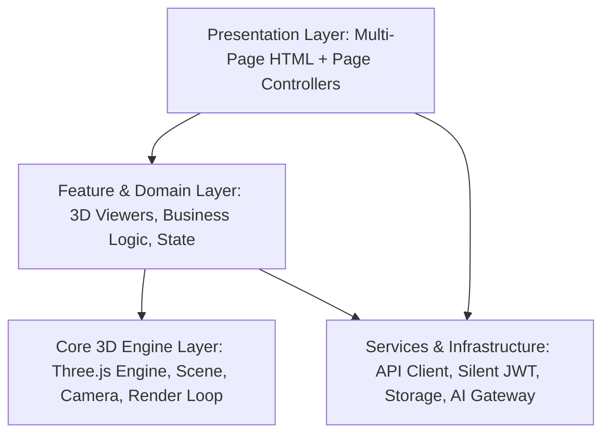

# 🧬 BIOVERSE - NỀN TẢNG GIÁO DỤC STEM 3D TƯƠNG TÁC
> **Interactive 3D STEM Learning Platform & Virtual Laboratory**  
> Dự án Frontend xây dựng trên nền tảng **Vanilla JavaScript ES Modules + Three.js + GSAP + Vite MPA**, mang trải nghiệm khám phá khoa học trực quan sinh động cho học sinh và công cụ quản trị giảng dạy mạnh mẽ cho giáo viên.

---

## 📑 MỤC LỤC
1. [Giới Thiệu Tổng Quan](#-1-giới-thiệu-tổng-quan)
2. [Điểm Nổi Bật & Tính Năng Trọng Tâm](#-2-điểm-nổi-bật--tính-năng-trọng-tâm)
3. [Kiến Trúc Kỹ Thuật (Tech Stack & Architecture)](#-3-kiến-trúc-kỹ-thuật-tech-stack--architecture)
4. [Sơ Đồ Cấu Trúc Thư Mục Toàn Dự Án](#-4-sơ-đồ-cấu-trúc-thư-mục-toàn-dự-án)
5. [Chi Tiết Các Phân Hệ & Trang Web (Routing & Pages)](#-5-chi-tiết-các-phân-hệ--trang-web-routing--pages)
   - [5.1. Phân Hệ Người Dùng & Học Sinh (Student Experience)](#51-phân-hệ-người-dùng--học-sinh-student-experience)
   - [5.2. Phân Hệ Xác Thực & Tài Khoản (Auth & Profile)](#52-phân-hệ-xác-thực--tài-khoản-auth--profile)
   - [5.3. Phân Hệ Quản Trị Viên (Admin Portal)](#53-phân-hệ-quản-trị-viên-admin-portal)
6. [Các Module Mô Phỏng 3D & Khoa Học (3D Simulations)](#-6-các-module-mô-phỏng-3d--khoa-học-3d-simulations)
7. [Dịch Vụ AI & Gamification](#-7-dịch-vụ-ai--gamification)
8. [Tầng Kết Nối API & Quản Lý Phiên (API & Auth Client)](#-8-tầng-kết-nối-api--quản-lý-phiên-api--auth-client)
9. [Ngôn Ngữ Thiết Kế (Scientific Sketchbook UI)](#-9-ngôn-ngữ-thiết-kế-scientific-sketchbook-ui)
10. [Hướng Dẫn Cài Đặt, Chạy Thử & Đóng Gói (Setup Guide)](#-10-hướng-dẫn-cài-đặt-chạy-thử--đóng-gói-setup-guide)

---

## 🌟 1. Giới Thiệu Tổng Quan

**BioVerse** là nền tảng công nghệ giáo dục (EdTech) tiên phong kết hợp đồ họa không gian 3D tương tác theo thời gian thực (WebGL/Three.js) với chương trình Khoa học Tự nhiên (Sinh học & Hóa học) cho học sinh THCS (Lớp 6 đến Lớp 9).

Dự án giải quyết bài toán cốt lõi trong giáo dục STEM:
- **Biến kiến thức vi mô và trừu tượng thành trực quan:** Từ cấu tạo tế bào, bào quan, hệ thống xương hộp sọ người, chuyển động nhịp đập cơ tim, đến cơ chế bẻ gãy và hình thành liên kết phân tử trong các phản ứng hóa học.
- **Thực hành an toàn không giới hạn:** Cung cấp phòng thí nghiệm ảo (Virtual Lab) cho phép học sinh thao tác bóc tách, cô lập, xoay lật 360 độ và chạy hoạt họa theo từng khung hình (keyframes).
- **Cá nhân hóa lộ trình học tập:** Tích hợp Trợ lý Trí tuệ Nhân tạo **BioBot** đóng vai trò gia sư ảo, hỗ trợ giải đáp thắc mắc khoa học 24/7 theo ngữ cảnh bài học.
- **Tạo động lực học tập bền vững (Gamification):** Hệ thống điểm kinh nghiệm (XP), cấp độ học thuật, theo dõi chuỗi ngày đăng nhập (Daily Streak), và bài thi trắc nghiệm đánh giá năng lực tức thì.

---

## 🚀 2. Điểm Nổi Bật & Tính Năng Trọng Tâm

| Nhóm tính năng | Nội dung chi tiết |
| :--- | :--- |
| **Thư Viện Mô Hình 3D (3D Catalog)** | Duyệt theo khối lớp (6-9) và chuyên đề; tìm kiếm realtime có debounce; bóc tách từng lớp cơ quan (Exploded View); cô lập bộ phận (Isolate Mode); ghim điểm tương tác (Interactive Hotspots) với danh pháp tiếng Việt chuẩn hóa. |
| **Phòng Thí Nghiệm Phản Ứng (Molecular Reaction Studio)** | Trực quan hóa cấu trúc nguyên tử & liên kết phân tử (đơn, đôi, ba, ion); bảng tuần hoàn tương tác; trình dựng chuyển động phân tử theo timeline keyframe (GSAP); hỗ trợ tệp định dạng mở `.chemx`; chế độ gia sư tương tác (Interactive Coach). |
| **Hệ Thống Trắc Nghiệm (Exams System)** | Danh mục đề thi phong phú; giao diện làm bài có đồng hồ bấm giờ; nộp bài và chấm điểm tự động; hệ thống xem lại đáp án và giải thích chi tiết; đồng bộ điểm số vào tiến trình cá nhân. |
| **Gia Sư Trí Tuệ Nhân Tạo (BioBot AI)** | Cửa sổ hội thoại thông minh hỗ trợ Markdown & công thức; lưu trữ lịch sử hội thoại nhiều phiên; gợi ý câu hỏi nhanh theo chuyên đề; cơ chế chống race-condition trong các truy vấn mạng. |
| **Gamification & Tiến Trình** | Tính toán cấp độ (Level 1: Mầm non sinh học -> Level 8: Viện sĩ BioVerse), điểm tích lũy XP, đếm ngày học liên tục (Streak), đặt mục tiêu mô hình hoàn thành trong tuần. |
| **Cổng Quản Trị Đa Phân Hệ (Admin Portal)** | Bàn điều hành trực quan (Admin Desk); quản lý danh mục (Categories); quản lý bài lab (Labs); quản trị mô hình 3D & tải lên Cloudflare R2/S3 (3D Models CRUD); quản trị phản ứng hóa học; quản lý người dùng & phân quyền RBAC. |
| **Bảo Mật & Quản Lý Phiên (Robust Auth)** | Xác thực JWT 2 tầng (Access Token + Refresh Token); cơ chế **Silent Token Refresh (Single-Flight)** chống xung đột xoay vòng khóa refresh của Spring Boot; phân quyền Guard chặn học sinh vào cổng Admin. |

---

## 🛠️ 3. Kiến Trúc Kỹ Thuật (Tech Stack & Architecture)

### 3.1. Công nghệ Lõi (Core Technologies)
- **Runtime & Language:** HTML5 Semantic + JavaScript chuẩn ES Modules thuần (Vanilla JS ES6+). Kiến trúc hướng Module hóa cao, 100% không dùng inline script trong HTML.
- **3D Graphics:** [Three.js](https://threejs.org/) (`^0.184.0`) - Khởi tạo WebGL Scene, OrbitControls, GLTFLoader, Raycasting để chọn lưới (mesh selection), điểm sáng động và tối ưu hóa hiệu năng render.
- **Animation & Transitions:** [GSAP](https://greensock.com/gsap/) (`^3.15.0`) - Điều khiển Timeline chuyển động nguyên tử, nội suy góc quay camera, hiệu ứng biến đổi UI và micro-interactions.
- **Build Tool:** [Vite](https://vitejs.dev/) (`^8.0.12`) - Hỗ trợ Multi-Page Application (MPA) với 17 entry points; tích hợp plugin tùy biến Clean URL Rewrite Middleware.
- **Cloud Storage:** [@aws-sdk/client-s3](https://aws.amazon.com/sdk-for-javascript/) (`^3.1075.0`) kết nối dịch vụ Cloudflare R2 / S3 phục vụ lưu trữ phân tán các tệp 3D GLB kích thước lớn.
- **Styling Architecture:** Vanilla CSS xây dựng theo hệ thống Design Tokens (Màu sắc, Font chữ, Khoảng cách), tuân thủ trường phái thiết kế **Scientific Sketchbook (Neo-Brutalism)**.

### 3.2. Mô Hình Kiến Trúc 4 Tầng (Clean Modular Layers)


---

## 📂 4. Sơ Đồ Cấu Trúc Thư Mục Toàn Dự Án

```
d:/university/EXE101-201/project/FE/
├── index.html                    # Trang Chủ BioVerse (Root Entry Dashboard)
│
├── pages/                        # Thư mục chứa toàn bộ 17 trang con đa trang (MPA)
│   ├── sinh-hoc.html             # Danh mục thư viện mô hình Sinh học 3D
│   ├── mo-hinh.html              # Trang tương tác chi tiết mô hình 3D (Specimen View)
│   ├── phan-ung.html             # Studio hoạt ảnh phản ứng phân tử & tương tác hóa học
│   ├── lab.html                  # Phòng thí nghiệm ảo đa chuyên đề
│   ├── exams.html                # Cổng làm bài thi & kiểm tra trắc nghiệm
│   ├── inspect.html              # Công cụ kỹ thuật kiểm tra file GLB/3D mesh
│   ├── login.html                # Trang Đăng nhập hệ thống
│   ├── register.html             # Trang Đăng ký tài khoản
│   ├── forgot-password.html      # Trang Yêu cầu đặt lại mật khẩu
│   ├── otp.html                  # Trang Xác thực mã OTP 6 số
│   ├── admin.html                # Bàn điều hành tổng quan Admin Desk
│   ├── admin-models.html         # Quản lý kho mô hình 3D & đồng bộ Cloud R2
│   ├── admin-categories.html     # Quản lý danh mục & khối lớp giáo dục
│   ├── admin-labs.html           # Quản lý cấu hình các phòng Lab
│   ├── admin-reactions.html      # Quản trị & duyệt kịch bản phản ứng hóa học
│   ├── admin-users.html          # Quản lý tài khoản người dùng
│   └── admin-roles.html          # Quản lý vai trò & quyền hạn (RBAC)
│
├── public/                       # Tài nguyên tĩnh phục vụ trực tiếp qua Web Server
│   ├── favicon.svg               # Logo biểu tượng BioVerse
│   ├── icons.svg                 # Bộ biểu tượng SVG sprite
│   ├── skull.glb                 # Mô hình Hộp sọ người bóc tách
│   ├── trung_giay.glb            # Mô hình Sinh vật đơn bào trùng giày
│   ├── mitosis_stages.glb        # Mô hình các kỳ phân bào tế bào
│   └── mitosis_animation.glb     # Hoạt họa chu kỳ phân bào động
│
├── scripts/                      # Script tự động hóa và công cụ Node.js
│   ├── upload-models.mjs         # Đồng bộ mô hình GLB cục bộ lên Cloudflare R2
│   ├── set-cors.mjs              # Cấu hình chính sách CORS trên R2 Bucket
│   ├── cors-worker.js            # Cloudflare Worker đóng vai trò CORS Proxy
│   └── inspect_glb.mjs           # Thanh tra danh sách node, mesh, vật liệu trong file GLB
│
├── src/
│   ├── api/                      # Tầng giao tiếp HTTP Backend API
│   │   ├── httpClient.js         # Fetch client có Silent Refresh Token & xử lý lỗi
│   │   ├── bioModelApi.js        # API danh mục và chi tiết mô hình 3D
│   │   ├── reactionApi.js        # API phản ứng hóa học học sinh
│   │   ├── aiApi.js              # API Trợ lý học tập BioBot (chat, history, session)
│   │   ├── adminBioModelApi.js   # API Quản trị mô hình (CRUD, upload, inspect)
│   │   ├── adminReactionApi.js   # API Quản trị phản ứng hóa học
│   │   ├── adminUserApi.js       # API Quản trị danh sách người dùng & desk
│   │   └── adminRoleApi.js       # API Quản trị vai trò & phân quyền
│   │
│   ├── core/                     # Lõi điều khiển đồ họa Three.js
│   │   └── engine.js             # Quản lý Scene, Camera, Renderer, Loop, Resize
│   │
│   ├── components/               # Các UI Component độc lập tái sử dụng
│   │   ├── chatBox.js            # Khung chat BioBot AI hoàn chỉnh (History drawer, typing)
│   │   └── modal.js              # Hộp thoại Modal & Toast thông báo hệ thống
│   │
│   ├── features/                 # Các Module Nghiệp Vụ Chuyên Biệt (Domain Features)
│   │   ├── model/                # Viewer 3D tổng quát (ModelViewer, anatomyData, partNames)
│   │   ├── reactionAnim/         # Studio phản ứng hóa học (MoleculeScene, GSAP Engine, .chemx)
│   │   ├── exams/                # Xử lý thi trắc nghiệm (Tải câu hỏi, chấm điểm, nộp bài)
│   │   ├── auth/                 # Quản lý xác thực người dùng (AuthService, Token Storage)
│   │   ├── progress/             # Quản lý tiến trình học tập (XP, Streak, Level, History)
│   │   ├── skull/                # Phân hệ Giải phẫu hộp sọ 22 xương
│   │   ├── organs/               # Phân hệ Hệ tim mạch & cơ thể người
│   │   ├── paramecium/           # Phân hệ Động vật nguyên sinh trùng giày
│   │   ├── plant/                # Phân hệ Tế bào & mô thực vật
│   │   └── mitosis/              # Phân hệ Quá trình phân bào (Mitosis)
│   │
│   ├── pages/                    # JavaScript Controller tương ứng cho từng trang HTML
│   │   ├── home.js               # Điều phối trang chủ (index.html)
│   │   ├── sinhHoc.js            # Điều phối trang thư viện sinh học (sinh-hoc.html)
│   │   ├── moHinh.js             # Điều phối trang xem mẫu vật 3D (mo-hinh.html)
│   │   ├── phanUng.js            # Điều phối Molecular Reaction Studio (phan-ung.html)
│   │   ├── exams.js              # Điều phối trang bài thi trắc nghiệm (exams.html)
│   │   ├── lab.js                # Điều phối trang Lab 3D đa năng (lab.html)
│   │   ├── login.js              # Xử lý đăng nhập (login.html)
│   │   ├── register.js           # Xử lý đăng ký (register.html)
│   │   ├── forgotPassword.js     # Xử lý quên mật khẩu (forgot-password.html)
│   │   ├── otp.js                # Xử lý nhập mã OTP (otp.html)
│   │   ├── adminDashboard.js     # Điều phối Dashboard Admin Desk (admin.html)
│   │   ├── adminModels.js        # Điều phối quản trị kho mô hình (admin-models.html)
│   │   ├── adminCategories.js    # Điều phối quản trị danh mục (admin-categories.html)
│   │   ├── adminLabs.js          # Điều phối quản trị bài lab (admin-labs.html)
│   │   ├── adminReactions.js     # Điều phối quản trị phản ứng (admin-reactions.html)
│   │   ├── adminUsers.js         # Điều phối quản trị người dùng (admin-users.html)
│   │   └── adminRoles.js         # Điều phối quản trị vai trò (admin-roles.html)
│   │
│   ├── services/                 # Cấu hình dịch vụ hạ tầng
│   │   ├── aiApi.js              # Cầu nối gửi nhận câu hỏi trợ lý ảo
│   │   └── modelUrls.js          # Phân giải đường dẫn tài nguyên 3D (Local vs Cloud R2)
│   │
│   ├── styles/                   # Hệ thống Style Module hóa
│   │   ├── sketchbook.css        # Chuẩn thiết kế Scientific Sketchbook (Neo-Brutalism)
│   │   ├── style.css             # Style nền tảng & layout controls
│   │   ├── modelViewer.css       # Style cho màn hình xem mẫu vật 3D & hotspots
│   │   ├── reactionAnim.css      # Style cho Studio phản ứng phân tử & Periodic table
│   │   ├── chatBox.css           # Style cho BioBot AI Chat & Drawer lịch sử
│   │   ├── exams.css             # Style cho giao diện làm bài thi trắc nghiệm
│   │   └── modal.css             # Style cho Modal xác nhận & Toast thông báo
│   │
│   └── utils/                    # Các hàm tiện ích thuần túy (Helper Functions)
│       ├── adminGuard.js         # Bộ lọc xác thực và quyền hạn truy cập Admin Portal
│       ├── adminMotion.js        # Hiệu ứng chuyển động GSAP cho Admin UI
│       ├── authNavbar.js         # Đồng bộ trạng thái đăng nhập trên Header/Navbar
│       ├── siteNav.js            # Xử lý chuyển hướng menu điều hướng chung
│       ├── dom.js                # Helper truy vấn DOM ($$, $, event listener)
│       ├── storage.js            # Thao tác an toàn với LocalStorage / SessionStorage
│       └── url.js                # Trích xuất và cập nhật Query Parameters
│
├── ARCHITECTURE.md               # Tài liệu kiến trúc hệ thống chi tiết
├── design.md                     # Bộ quy chuẩn thiết kế Scientific Sketchbook Design System
├── package.json                  # Cấu hình phụ thuộc và scripts npm
├── vite.config.js                # Cấu hình đóng gói Vite MPA, Clean URL & Proxy API
└── vercel.json                   # Cấu hình định tuyến Rewrite/Redirect khi deploy Vercel
```

---

## 🧭 5. Chi Tiết Các Phân Hệ & Trang Web (Routing & Pages)

Vite Dev Server và Vercel Serverless đều được cấu hình hỗ trợ cả 2 định dạng: **Clean URLs** (chuẩn SEO: `/sinh-hoc`, `/mo-hinh`) và định dạng tệp vật lý (`/pages/sinh-hoc.html`).

### 5.1. Phân Hệ Người Dùng & Học Sinh (Student Experience)

#### 1. Trang Chủ (`/` ↔ `index.html`)
- **Controller:** [`src/pages/home.js`](file:///d:/university/EXE101-201/project/FE/src/pages/home.js)
- **Chức năng:**
  - Hero Banner chào mừng cá nhân hóa theo tên học sinh đã đăng nhập.
  - Hiển thị cấp độ học thuật (Level), danh hiệu khoa học, số điểm tích lũy XP.
  - Hiển thị chuỗi ngày học tập liên tục (Streak Counter) và kỷ lục chuỗi dài nhất.
  - Thanh tiến độ mục tiêu tuần (Weekly Goal Bar) tự động cập nhật khi học sinh khám phá mô hình.
  - Thẻ truy cập nhanh vào các phòng thí nghiệm chính (Sinh học, Phản ứng Hóa học, Phòng Lab, Trắc nghiệm).
  - Tự động điều hướng tài khoản có vai trò `ADMIN` sang `/admin`.

#### 2. Thư Viện Sinh Học 3D (`/sinh-hoc` ↔ `pages/sinh-hoc.html`)
- **Controller:** [`src/pages/sinhHoc.js`](file:///d:/university/EXE101-201/project/FE/src/pages/sinhHoc.js)
- **Chức năng:**
  - Tải danh sách mô hình từ API `GET /api/models/catalog`.
  - Bộ lọc kết hợp: Lọc theo khối lớp (Lớp 6, 7, 8, 9) và theo Danh mục chuyên đề (Thực vật, Động vật, Giải phẫu người, Vi sinh vật).
  - Thanh tìm kiếm tức thì theo từ khóa với kỹ thuật **Debounce (350ms)** giúp giảm tải request.
  - Đồng bộ trạng thái bộ lọc vào URL Query String (`?grade=8&category=anatomy&q=tim`) hỗ trợ bookmark hoặc chia sẻ liên kết.
  - Phân trang bất đồng bộ với trạng thái Loading Skeleton và Empty State thân thiện.

#### 3. Khám Phá Mẫu Vật 3D Chi Tiết (`/mo-hinh` ↔ `pages/mo-hinh.html`)
- **Controller:** [`src/pages/moHinh.js`](file:///d:/university/EXE101-201/project/FE/src/pages/moHinh.js) & [`ModelViewer.js`](file:///d:/university/EXE101-201/project/FE/src/features/model/ModelViewer.js)
- **Chức năng:**
  - Tải mô hình thông qua tham số `?id=...` hoặc `?slug=...`.
  - **Chế độ Bóc tách (Exploded View):** Tính toán tâm hình học và dịch chuyển các mesh thành phần ra xa tâm theo vector pháp tuyến, giúp quan sát các bộ phận bị che khuất bên trong.
  - **Chế độ Cô lập (Isolate Mode):** Làm mờ hoặc ẩn toàn bộ các bộ phận xung quanh, tập trung chiếu sáng và phóng to vào chi tiết được chọn.
  - **Preset Camera:** Phím tắt đổi góc máy nhanh: Mặt trước (Front), Mặt bên (Side), Mặt trên (Top).
  - **Điểm ghim tương tác (Interactive Hotspots/Pins):** Điểm đánh dấu 3D neo bám trực tiếp vào tọa độ mesh trong không gian 3D, tự động tính toán chiếu lại tọa độ màn hình 2D (Screen Space Projection).
  - **Từ điển Danh pháp Tiếng Việt:** [`partNames.js`](file:///d:/university/EXE101-201/project/FE/src/features/model/partNames.js) nhận diện và chuyển ngữ các node tiếng Anh kỹ thuật (ví dụ: `Cranial_Bone`, `Left_Ventricle`) sang thuật ngữ y sinh chuẩn xác.
  - Tự động cộng điểm XP (+50 XP) khi học sinh khám phá hoàn tất mô hình.

#### 4. Studio Phản Ứng Phân Tử 3D (`/phan-ung` ↔ `pages/phan-ung.html`)
- **Controller:** [`src/pages/phanUng.js`](file:///d:/university/EXE101-201/project/FE/src/pages/phanUng.js) & [`moleculeScene.js`](file:///d:/university/EXE101-201/project/FE/src/features/reactionAnim/moleculeScene.js)
- **Chức năng:**
  - **Mô phỏng Nguyên tử & Phân tử 3D:** Khởi tạo các nguyên tử hình cầu chuẩn quy chuẩn màu CPK (H: Trắng, O: Đỏ, C: Xám, N: Xanh dương, Cl: Xanh lục...) và các liên kết hóa học dạng ống trụ (CylinderMesh).
  - **Bảng Tuần Hoàn Mini Tương Tác:** Chọn nguyên tố thêm vào không gian phản ứng.
  - **Timeline Keyframe Animation:** Sử dụng GSAP Timeline điều phối vị trí, góc xoay và trạng thái liên kết theo từng bước phản ứng (Ví dụ: $2H_2 + O_2 \rightarrow 2H_2O$, $H_2 + Cl_2 \rightarrow 2HCl$).
  - **Interactive Coach (Gia sư hướng dẫn):** Hướng dẫn học sinh thao tác theo từng bước phản ứng, kiểm tra xem học sinh đã kéo thả đúng nguyên tử vào vùng tương tác hay chưa.
  - **Định dạng tệp `.chemx`:** Hỗ trợ đọc, chỉnh sửa và xuất file cấu hình phản ứng dạng tệp `.chemx` để lưu vào sổ tay cá nhân (Notebook) hoặc chia sẻ cho bạn bè.

#### 5. Đề Thi & Trắc Nghiệm Ôn Tập (`/exams` ↔ `pages/exams.html`)
- **Controller:** [`src/pages/exams.js`](file:///d:/university/EXE101-201/project/FE/src/pages/exams.js) & [`src/features/exams/exams.js`](file:///d:/university/EXE101-201/project/FE/src/features/exams/exams.js)
- **Chức năng:**
  - Danh sách đề kiểm tra đa dạng theo môn học, khối lớp và mức độ khó.
  - Màn hình xem chi tiết thông tin bài thi trước khi bắt đầu.
  - Chế độ làm bài thi: Giao diện trực quan, bảng điều hướng danh sách câu hỏi nhanh, đếm ngược thời gian thực (Countdown Timer).
  - Chấm điểm tự động và lưu vết vào hệ thống: Hiển thị bảng tổng kết số câu đúng/sai, phần trăm hoàn thành, và nhận xét học lực.
  - Chế độ Xem lại (Review Mode): Hiển thị chi tiết đáp án của học sinh so với đáp án đúng kèm lời giải thích khoa học cặn kẽ.

---

### 5.2. Phân Hệ Xác Thực & Tài Khoản (Auth & Profile)

Toàn bộ logic xử lý tập trung trong [`AuthService.js`](file:///d:/university/EXE101-201/project/FE/src/features/auth/authService.js) và [`storage.js`](file:///d:/university/EXE101-201/project/FE/src/utils/storage.js):
- **Đăng Nhập (`/login`):** Gửi thông tin đăng nhập đến `/api/auth/login`. Nhận AccessToken & RefreshToken, lưu an toàn vào LocalStorage, điều hướng thông minh theo vai trò người dùng.
- **Đăng Ký (`/register`):** Tạo tài khoản mới, kiểm tra tính hợp lệ của mật khẩu, họ tên, email trước khi gọi `/api/auth/register`.
- **Nhập Mã OTP (`/otp`):** 6 ô nhập mã OTP tự động focus chuyển ô khi gõ phím, tự động bắt sự kiện Paste từ clipboard, đếm ngược 60 giây gửi lại mã xác thực.
- **Quên Mật Khẩu (`/forgot-password`):** Gửi yêu cầu đặt lại mật khẩu qua email người dùng.
- **Quản lý Phiên:** Khi đăng xuất hoặc token hết hạn hoàn toàn, xóa sạch session và chuyển hướng an toàn về `/login`.

---

### 5.3. Phân Hệ Quản Trị Viên (Admin Portal)

Tất cả các trang Quản trị đều được bảo vệ nghiêm ngặt bằng [`adminGuard.js`](file:///d:/university/EXE101-201/project/FE/src/utils/adminGuard.js). Nếu người dùng chưa đăng nhập hoặc không sở hữu quyền `ADMIN`, hệ thống lập tức chặn truy cập và hiển thị thông báo yêu cầu quyền điều hành.

```
/admin               -> Bàn điều hành tổng quan (Admin Desk)
/admin-models        -> Quản lý & kiểm tra mô hình 3D
/admin-categories    -> Quản lý danh mục giáo dục
/admin-labs          -> Quản lý phòng thí nghiệm ảo
/admin-reactions     -> Quản lý kịch bản phản ứng hóa học
/admin-users         -> Quản lý người dùng học sinh/giáo viên
/admin-roles         -> Quản lý vai trò & quyền hạn (RBAC)
```

1. **Admin Desk (`/admin`):** Thống kê số lượng mô hình đang phát hành, tổng tài nguyên trên Cloudflare R2, số người dùng đăng ký mới, số vai trò đang hiệu lực, cùng biểu đồ trực quan hóa dữ liệu thống kê.
2. **Quản lý Mô hình (`/admin-models`):** 
   - Danh sách mô hình 3D kèm thumbnail và trạng thái phân phối.
   - Thêm mới, chỉnh sửa thông tin metadata, gán khối lớp và danh mục.
   - Trình tích hợp xem thử mô hình 3D trực tiếp trong modal: xem lưới (wireframe), kiểm tra node hierarchy, đặt góc máy mặc định và ghim điểm hotspots.
   - Đồng bộ và tải tệp GLB trực tiếp lên Cloudflare R2 Bucket.
3. **Quản lý Danh mục (`/admin-categories`):** Cây danh mục theo từng môn học và khối lớp, cho phép tạo mới, sửa tên, đổi icon, kích hoạt hoặc tạm ẩn danh mục.
4. **Quản lý Phòng Lab (`/admin-labs`):** Cấu hình các kịch bản bài học thực hành tương tác.
5. **Quản trị Phản ứng (`/admin-reactions`):** Kiểm duyệt kịch bản phản ứng hóa học do giáo viên hoặc học sinh gửi lên, xuất/nhập tệp `.chemx`.
6. **Quản lý Người dùng & Phân quyền (`/admin-users`, `/admin-roles`):** Khóa/mở khóa tài khoản, cấp quyền vai trò (`STUDENT`, `TEACHER`, `ADMIN`), theo dõi lần đăng nhập gần nhất.

---

## 🔬 6. Các Module Mô Phỏng 3D & Khoa Học (3D Simulations)

| Thư mục Feature | Tên Module | Trọng tâm mô phỏng & Kiến thức khoa học |
| :--- | :--- | :--- |
| `src/features/skull/` | **Hộp sọ người (Skull Anatomy)** | Mô phỏng 22 mảnh xương sọ và mặt (Xương trán, đỉnh, thái dương, bướm, gò má, hàm trên, hàm dưới...). Hỗ trợ raycasting nhấp chọn từng mảnh xương, đổi màu highlight và hiển thị thẻ chú thích y khoa. |
| `src/features/organs/` | **Hệ Tuần Hoàn & Cơ Thể (Human Organs)** | Mô phỏng nhịp đập cơ tim theo chu kỳ tâm thu/tâm trương; bóc tách 4 buồng tim (tâm thất, tâm nhĩ) và hệ thống van tim, động mạch chủ, tĩnh mạch chủ. |
| `src/features/paramecium/` | **Trùng Giày (Paramecium)** | Cấu tạo sinh vật đơn bào: Nhân lớn (Macronucleus), nhân nhỏ (Micronucleus), rãnh miệng (Oral groove), không bào co bóp (Contractile vacuole) và hệ thống lông bơi rung động. |
| `src/features/plant/` | **Sinh Học Thực Vật (Plant Anatomy)** | Cấu trúc rễ, thân, lá và mô tế bào thực vật; cơ chế dẫn truyền nước và chất dinh dưỡng qua mạch rây và mạch gỗ. |
| `src/features/mitosis/` | **Quá Trình Phân Bào (Mitosis)** | Mô phỏng 4 kỳ nguyên phân: Kỳ đầu (Prophase), Kỳ giữa (Metaphase - xếp hàng trên mặt phẳng xích đạo), Kỳ sau (Anaphase - tách nhiễm sắc thể đơn), và Kỳ cuối (Telophase - phân chia tế bào chất). |
| `src/features/reactionAnim/` | **Phản Ứng Phân Tử (Molecular Studio)** | Dựng không gian 3D biểu diễn nguyên tử theo bán kính van der Waals; biểu diễn liên kết hóa học; điều khiển tiến trình phản ứng qua timeline mượt mà. |

---

## 🤖 7. Dịch Vụ AI & Gamification

### 7.1. Trợ Lý Học Tập Ảo BioBot AI ([`chatBox.js`](file:///d:/university/EXE101-201/project/FE/src/components/chatBox.js))
- **Giao diện hiện đại:** Tích hợp nút kích hoạt nổi ở góc màn hình trên tất cả các trang; có thể mở rộng toàn phần hoặc thu gọn linh hoạt.
- **Trải nghiệm hội thoại sống động:**
  - Hiệu ứng gõ chữ thời gian thực (Typewriter Effect).
  - Trình phân tích cú pháp Markdown cho câu trả lời: hiển thị đậm, nghiêng, danh sách gạch đầu dòng, công thức hóa học và code blocks.
  - Gợi ý câu hỏi thông minh theo ngữ cảnh mô hình học sinh đang mở.
- **Quản lý phiên hội thoại đa tầng (Conversation Drawer):** 
  - Lưu trữ lịch sử chat theo từng người dùng (User ID) hoặc lưu tạm cho khách vãng lai (Guest).
  - Tạo mới đoạn chat, xem lại lịch sử các buổi học trước đó hoặc xóa lịch sử tùy ý.
- **Cơ chế chống xung đột mạng (Anti-Race Condition):** Sử dụng `AbortController` và chuỗi `requestToken` để hủy bỏ các request lỗi thời khi người dùng liên tục chuyển đổi phiên chat.

### 7.2. Động Lực Học Tập & Gamification ([`progressService.js`](file:///d:/university/EXE101-201/project/FE/src/features/progress/progressService.js))
- **Hệ thống Cấp độ (Levels & Titles):**
  - Cấp 1 (0 - 100 XP): *Mầm non sinh học*
  - Cấp 2 (101 - 250 XP): *Người tập quan sát*
  - Cấp 3 (251 - 450 XP): *Nhà thám hiểm tế bào*
  - Cấp 4 (451 - 700 XP): *Nhà giải phẫu tập sự*
  - Cấp 5 (701 - 1000 XP): *Chuyên viên phòng lab*
  - Cấp 6 (1001 - 1400 XP): *Bậc thầy mô phỏng*
  - Cấp 7 (1401 - 2000 XP): *Nhà nghiên cứu STEM*
  - Cấp 8 (> 2000 XP): *Viện sĩ BioVerse*
- **Chuỗi Đăng Nhập (Daily Streak):** Theo dõi ngày học gần nhất. Nếu người dùng quay lại vào ngày hôm sau, chuỗi ngày tăng thêm 1; nếu bỏ lỡ quá 1 ngày, chuỗi sẽ tự động cài lại về ngày 1.
- **Mục Tiêu Tuần (Weekly Goal):** Theo dõi số lượng mô hình 3D học sinh hoàn thành trong tuần (ví dụ: 3/5 mô hình, đạt 60% mục tiêu).
- **Hệ Thống Custom Event:** Bắn tín hiệu `bioverse_progress_updated` và `bioverse_streak_updated` để tất cả các widget trên trang và các tab trình duyệt khác nhau tự động đồng bộ ngay lập tức.

---

## 🌐 8. Tầng Kết Nối API & Quản Lý Phiên (API & Auth Client)

### 8.1. Cơ Chế Silent JWT Refresh Single-Flight ([`httpClient.js`](file:///d:/university/EXE101-201/project/FE/src/api/httpClient.js))
Khi tương tác với Backend Spring Boot, các yêu cầu mạng được bọc qua hàm `authFetch()`:
1. Tự động đính kèm `Authorization: Bearer <AccessToken>` vào Header.
2. Nếu Backend trả về mã lỗi `HTTP 401 Unauthorized`:
   - Không đăng xuất người dùng ngay lập tức.
   - Tự động gọi endpoint `/api/auth/refresh` kèm `refreshToken`.
   - **Xử lý Concurrent Single-Flight:** Khi có nhiều request song song cùng gặp 401, tất cả cùng chờ chung **duy nhất một Promise refresh**. Điều này ngăn ngừa việc gửi nhiều request refresh đồng thời làm vô hiệu hóa token xoay vòng (Refresh Token Rotation) ở phía máy chủ.
   - Sau khi có AccessToken mới, tự động gửi lại (retry) request ban đầu một cách êm ái mà người dùng không hề nhận thấy gián đoạn.
   - Nếu quá trình refresh thất bại (token hết hạn hẳn), xóa sạch thông tin phiên và chuyển hướng về `/login`.

### 8.2. Danh Sách Các Endpoint API Chính
- **Auth:**
  - `POST /api/auth/login` - Đăng nhập
  - `POST /api/auth/register` - Đăng ký
  - `POST /api/auth/refresh` - Cấp lại access token
  - `POST /api/auth/otp/verify` - Xác thực mã OTP
- **Mô Hình 3D (Models):**
  - `GET /api/models/catalog` - Danh sách mô hình phân trang & lọc
  - `GET /api/models/categories` - Danh mục môn học
  - `GET /api/models/{id}` hoặc `GET /api/models/slug/{slug}` - Chi tiết mô hình
- **AI Trợ Lý:**
  - `POST /api/ai/chat` - Gửi tin nhắn học tập
  - `GET /api/ai/conversations` - Danh sách cuộc hội thoại
  - `GET /api/ai/conversations/{id}/messages` - Lịch sử tin nhắn
- **Admin APIs:**
  - `GET /api/admin/desk` - Thống kê vận hành tổng thể
  - `GET /api/admin/models`, `POST /api/admin/models` - CRUD mô hình
  - `GET /api/admin/r2/assets` - Danh sách tài nguyên đám mây
  - `GET /api/admin/users`, `PUT /api/admin/users/{id}/status` - Quản trị người dùng

---

## 🎨 9. Ngôn Ngữ Thiết Kế (Scientific Sketchbook UI)

Giao diện BioVerse được xây dựng dựa trên phong cách **Sổ Tay Khoa Học Hiện Đại (Scientific Sketchbook / Neo-Brutalism)** kết hợp tính thẩm mỹ phòng thí nghiệm cao cấp:
- **Đường viền đậm nét & Đổ bóng sắc dứt khoát:** Sử dụng các đường kẻ viền đen/xám than đặc trưng (`border: 2px solid var(--ink)`), bóng đổ cứng (`box-shadow: 4px 4px 0px var(--ink)`), tạo cảm giác như những khối sổ tay vật lý trên bàn thí nghiệm.
- **Bảng Màu Khoa Học (Harmonious Scientific Palette):**
  - Nền giấy ngà ấm áp: `--paper: #fbfbf9`, `--paper-card: #ffffff`
  - Mực viết khoa học: `--ink: #18191a`, `--ink-muted: #5e656d`
  - Màu nhấn Sinh học (Chlorophyll Green): `#10b981`, `#059669`
  - Màu nhấn Hóa học & Phân tử (Cyber Blue / Cyan): `#0284c7`, `#06b6d4`
  - Màu nhấn Cảnh báo & Nổi bật (Amber / Coral): `#f59e0b`, `#f43f5e`
- **Typography Hiện Đại:** Tích hợp font chữ kỹ thuật số sắc nét kết hợp font tiêu đề công nghệ (Plus Jakarta Sans, Be Vietnam Pro, JetBrains Mono cho các mã code và công thức).
- **Hỗ Trợ Accessibility:** Tương thích chế độ giảm chuyển động (`prefers-reduced-motion`) cho học sinh nhạy cảm với hiệu ứng đồ họa 3D.

---

## 💻 10. Hướng Dẫn Cài Đặt, Chạy Thử & Đóng Gói (Setup Guide)

### 10.1. Yêu Cầu Môi Trường
- **Node.js:** Phiên bản 18.x hoặc 20.x trở lên.
- **Trình Quản Lý Gói:** `npm` (đi kèm Node.js).
- **Trình Duyệt Hỗ Trợ:** Chrome, Edge, Firefox, Safari phiên bản mới có bật hỗ trợ phần cứng **WebGL 2.0**.
- **Backend (Tùy chọn khi test đầy đủ tính năng):** Backend API chạy tại `http://localhost:8080`.

### 10.2. Cài Đặt Thư Viện
Mở terminal tại thư mục gốc của dự án (`d:/university/EXE101-201/project/FE/`):
```bash
npm install
```

### 10.3. Cấu Hình Biến Môi Trường (`.env`)
Tạo file `.env` từ file mẫu `.env.example`:
```bash
cp .env.example .env
```
Nội dung file `.env`:
```ini
# Runtime: Gọi mô hình qua API Backend (Vite proxy /api -> http://localhost:8080)
VITE_MODEL_API_BASE=/api/models

# Cấu hình tải mô hình lên Cloudflare R2 (Chỉ dùng cho script admin `npm run upload-models`)
R2_ACCOUNT_ID=your_cloudflare_account_id
R2_ACCESS_KEY_ID=your_r2_access_key
R2_SECRET_ACCESS_KEY=your_r2_secret_key
R2_BUCKET_NAME=bio3d-models
```

### 10.4. Khởi Chạy Môi Trường Phát Triển (Development Server)
```bash
npm run dev
```
Trình duyệt sẽ mở tại địa chỉ mặc định: `http://localhost:5173`
- Trang chủ: `http://localhost:5173/`
- Thư viện sinh học: `http://localhost:5173/sinh-hoc`
- Studio phản ứng phân tử: `http://localhost:5173/phan-ung`
- Đề thi trắc nghiệm: `http://localhost:5173/exams`
- Cổng quản trị: `http://localhost:5173/admin`

*Ghi chú:* Vite dev server đã tích hợp sẵn proxy `/api` tự động chuyển tiếp các request tới `http://localhost:8080` mà không gây lỗi CORS.

### 10.5. Đóng Gói Ứng Dụng (Production Build)
```bash
npm run build
```
Vite sẽ biên dịch toàn bộ 17 trang HTML, tối ưu hóa CSS, đóng gói JavaScript và xuất bản vào thư mục `dist/`.

Để kiểm tra bản build trước khi deploy:
```bash
npm run preview
```

### 10.6. Triển Khai Lên Vercel (Deployment)
Dự án đã có sẵn tệp cấu hình chuẩn [`vercel.json`](file:///d:/university/EXE101-201/project/FE/vercel.json) với toàn bộ quy tắc **Rewrites** và **Redirects** chuẩn Clean URL. Khi liên kết kho mã nguồn với Vercel:
- **Framework Preset:** `Vite`
- **Build Command:** `npm run build`
- **Output Directory:** `dist`

---

## 👥 Nhóm Tác Giả & Bản Quyền
- **Dự án:** BioVerse Frontend (`BioVerseTeam/Frontend_Bioverse`)
- **Khóa học / Bộ môn:** Dự án Phát triển Ứng dụng Giáo dục STEM (EXE101 - 201)
- **Bản quyền:** © 2026 BioVerse Team. Toàn bộ mã nguồn và mô hình được xây dựng phục vụ mục đích giáo dục.
